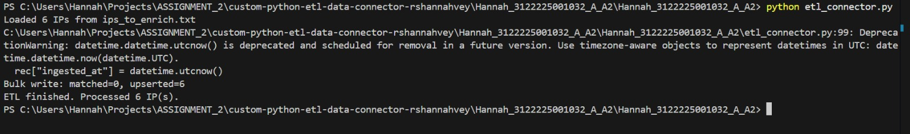
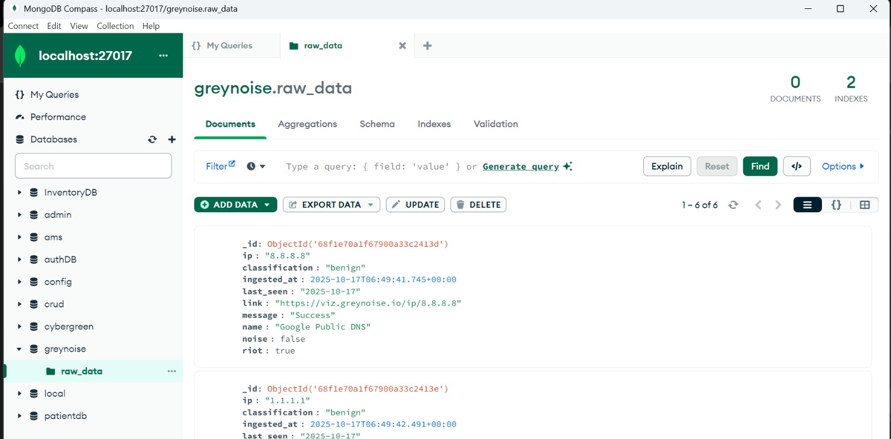
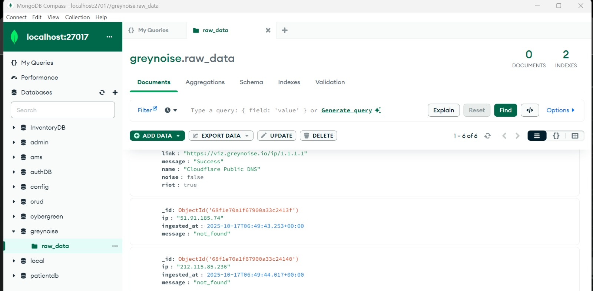
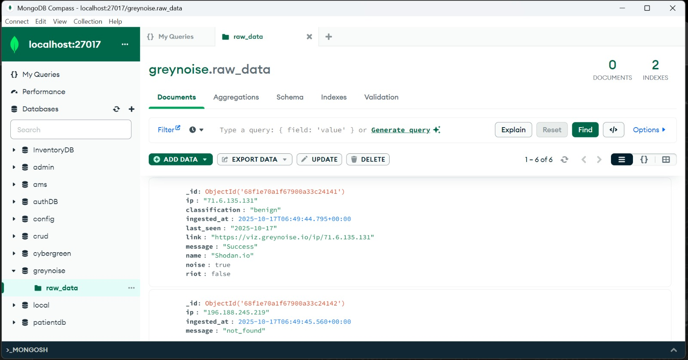

<!DOCTYPE html>
<html lang="en">
<body>
  <h1>GreyNoise ETL Connector</h1>

  <h2>Project Overview</h2>
  

    This project is an ETL (Extract, Transform, Load) pipeline that interacts with the <strong>GreyNoise Threat Intelligence API</strong>
    to retrieve contextual data for specific IP addresses. The pipeline extracts raw data from the GreyNoise API,
    transforms the response into a MongoDB-compatible schema, and loads it into a MongoDB collection for storage,
    visualization, and further analysis.
  

  <h2>API Details</h2>
  <h3>Base URL</h3>
  <pre><code>https://api.greynoise.io/v3/community/</code></pre>

  <h3>Endpoints Used</h3>
  <ul>
    <li><strong>Community IP Lookup</strong> 
      Retrieves information about a specific IP address to determine if it has been observed by GreyNoise sensors. 
      Endpoint URL Format: <code>https://api.greynoise.io/v3/community/&lt;ip&gt;</code> 
      <strong>Example:</strong> <code>https://api.greynoise.io/v3/community/8.8.8.8</code>
    </li>
  </ul>

  <h3>Sample IPs Queried</h3>
  <ul>
    <li>8.8.8.8</li>
    <li>1.1.1.1</li>
    <li>51.91.185.74</li>
    <li>212.115.85.236</li>
    <li>71.6.135.131</li>
    <li>196.188.245.219</li>
  </ul>

  <h3>Authentication</h3>
  

    The GreyNoise API requires authentication using an API key. The key is passed in the HTTP request header:
  

  <pre><code>key: &lt;greynoise_api_key&gt;</code></pre>
  

    The API key is securely stored in the <code>.env</code> file and accessed through environment variables in the ETL script.
  

  <h2>Usage Instructions</h2>

  <h3>1. Prerequisites</h3>
  <ul>
    <li>Python 3.8 or higher</li>
    <li>MongoDB running locally or remotely</li>
    <li>Required Python packages installed via <code>requirements.txt</code></li>
    <li>Valid GreyNoise API Key</li>
  </ul>

  <h3>2. Setup</h3>
  <pre><code>git clone &lt;your-repository-url&gt;
cd &lt;project-folder&gt;
pip install -r requirements.txt
  </code></pre>

  
Create a <code>.env</code> file in the root directory with the following variables:

  <pre><code>
# MongoDB Configuration
MONGODB_URI=mongodb://localhost:27017
MONGODB_DB=greynoise
MONGODB_COLLECTION=raw_data

<h3>GreyNoise API Key</h3>GREYNOISE_API_KEY = actual_greynoise_api_key
<h3>Optional ETL parameters</h3>BATCH_SIZE=200
SLEEP_BETWEEN=0.5
  </code></pre>

  <h3>3. Running the ETL Script</h3>
  <pre><code>python etl_connector.py
  </code></pre>
  
The script will:

  <ul>
    <li>Read IP addresses from <code>ips_to_enrich.txt</code> (or use default sample IPs if not found).</li>
    <li>Fetch details for each IP using the GreyNoise Community API.</li>
    <li>Transform the JSON response for MongoDB compatibility by adding timestamps and normalizing fields.</li>
    <li>Insert or update the records in MongoDB using <strong>bulk upsert</strong> operations.</li>
  </ul>

  <h2>Code Explanation</h2>
  <ul>
    <li><code>lookup_ip(ip)</code>: Sends an authenticated GET request to the GreyNoise API for each IP and handles retries for rate limits.</li>
    <li><code>transform_record(raw)</code>: Normalizes data, adds <code>ingested_at</code> timestamp, and ensures consistent schema for MongoDB.</li>
    <li><code>bulk_upsert(collection, ops)</code>: Performs batch insertion or updates to efficiently store results in MongoDB.</li>
    <li><code>main()</code>: Coordinates loading environment variables, connecting to MongoDB, iterating through IPs, and managing ETL flow.</li>
  </ul>

  <h2>Output for etl_connector.py
  </h2>
    

  
In MongoDB, documents inserted have the following structure:

 

  <h2>Iterative Testing & Validation</h2>
  <ul>
    <li><strong>Rate Limits:</strong> The ETL automatically handles HTTP 429 responses (rate limit) by exponential backoff and retrying the request.</li>
    <li><strong>Error Handling:</strong> Catches and logs connection errors, invalid responses, and skipped IPs during failures.</li>
    <li><strong>Bulk Operations:</strong> Uses <code>bulk_write()</code> for efficient upserts and to handle large batches of IP lookups.</li>
    <li><strong>Resumability:</strong> Since updates are upserts, rerunning the script will simply refresh or add missing IP data.</li>
  </ul>

  <h3>Conclusion</h3>

  <ul>
    <li>The ETL pipeline successfully integrates with the <strong>GreyNoise Community API</strong> using secure authentication.</li>
    <li>Handles multiple IP queries efficiently and inserts structured data into MongoDB collections.</li>
    <li>Implements retry logic, rate-limit handling, and batch upserts for robustness.</li>
    <li>Provides clean and standardized data with timestamps, suitable for visualization and analysis.</li>
    <li>This project demonstrates secure API integration, data cleaning, and automated database population for cybersecurity intelligence use cases.</li>
  </ul>

</body>
</html>
