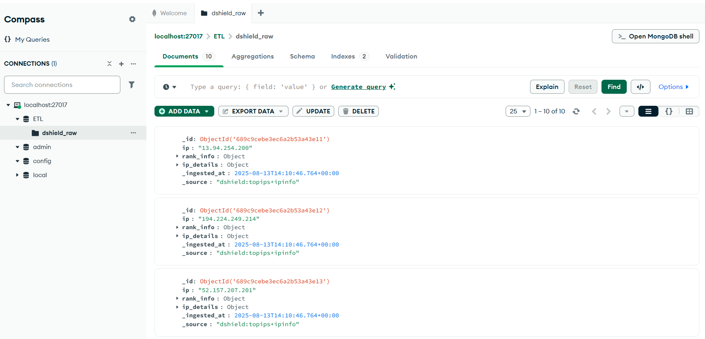

# DShield ETL Connector - Top IPs + IP Info

## 📌 Overview
This Python script extracts the **top attacking IP addresses** from the [DShield REST API](https://www.dshield.org/api/), retrieves detailed IP information, transforms the data, and loads it into a MongoDB database.

It is designed as an ETL (Extract-Transform-Load) pipeline for cybersecurity data analysis.

---

## ⚙️ Features
- **Extract**: Fetches top attacking IPs from DShield.
- **Transform**: Enriches each IP with detailed information from DShield's IP Info API.
- **Load**: Saves the transformed data into a MongoDB collection.
- **Logging**: Prints before/after transformation samples.
- **Error handling**: Handles rate limiting, network errors, and MongoDB insertion failures.

---

## 🔌 Requirements
- Python **3.9+**
- MongoDB (local or cloud)
- DShield API access (no authentication required, but rate limits apply)

---

## 📂 Installation

1. **Clone the repository**
```bash
git clone https://github.com/Kyureeus-Edtech/custom-python-etl-data-connector-Vishnu-praba-aj.git
```

2. **Create and activate a virtual environment**
```bash
python -m venv venv
source venv/bin/activate   # macOS/Linux
venv\Scripts\activate      # Windows
```

3. **Install dependencies**
```bash
pip install -r requirements.txt
```

---

## Environment Variables
Create a `.env` file in the project root:

```env
MONGODB_URI= Host URI
MONGODB_DB= DB name
MONGODB_COLLECTION= Collection Name
DSHIELD_BASE_URL=https://www.dshield.org/api
USER_AGENT_EMAIL=youremail@example.com
```

---


## Usage
Run the ETL connector:
```bash
python etl_connector.py
```

**What it does:**
1. Pings MongoDB to check connectivity.
2. Fetches the **Top IPs** list from DShield.
3. For each IP, fetches **detailed IP info**.
4. Combines the two datasets.
5. Saves them into MongoDB.

---

## DShield API Endpoints Used

### 1. **Top IPs**
* **Endpoint**: `/topips`  
* **Example URL**:
```
https://www.dshield.org/api/topips?json
```
* **Response Example**:
```json
{
  "topips": [
    {
      "rank": 1,
      "source": "13.94.254.200",
      "reports": 319739,
      "targets": 1
    },
    {
      "rank": 2,
      "source": "194.224.249.214",
      "reports": 309508,
      "targets": 1
    }
  ]
}
```

### 2. **IP Info**
* **Endpoint**: `/ip/{ip}`  
* **Example URL**:
```
https://www.dshield.org/api/ip/13.94.254.200?json
```
* **Response Example**:
```json
{
  "ip": {
    "number": "13.94.254.200",
    "asn": "AS8075",
    "country": "US",
    "attacks": 1023
  }
}
```

---


## Example Log Output
Output before transform:


Output after transform:


---

## MongoDB Output Example



---

## Notes
* The DShield API enforces **rate limits** (HTTP 429). The script will retry automatically.
* If MongoDB is remote, ensure the connection string and firewall rules are correct.

---

## License
MIT License.  
Data provided by [DShield.org](https://www.dshield.org/).
