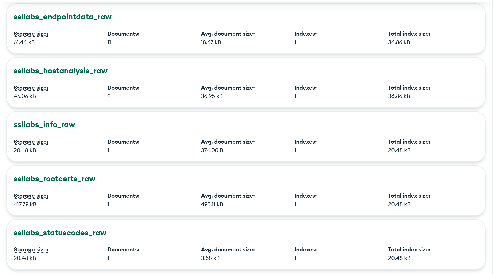
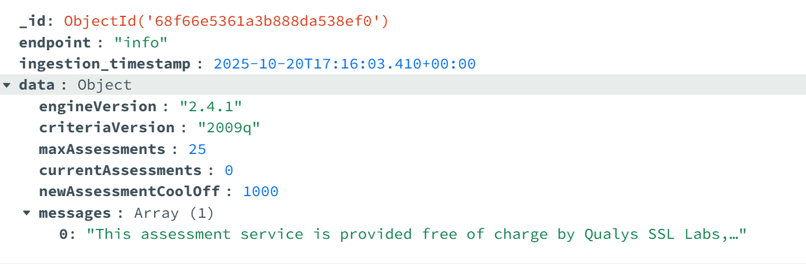
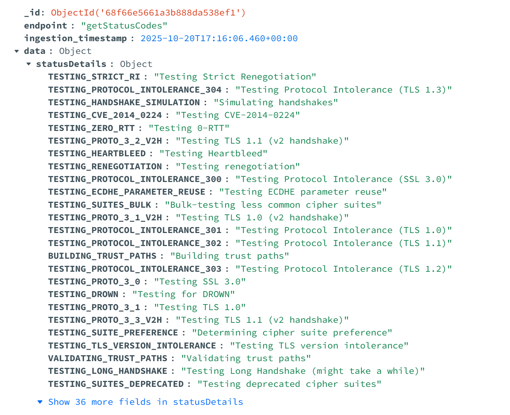
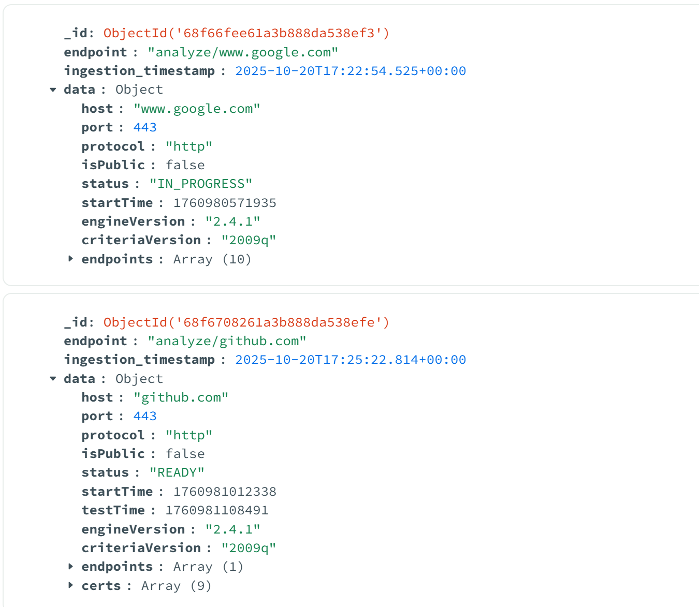
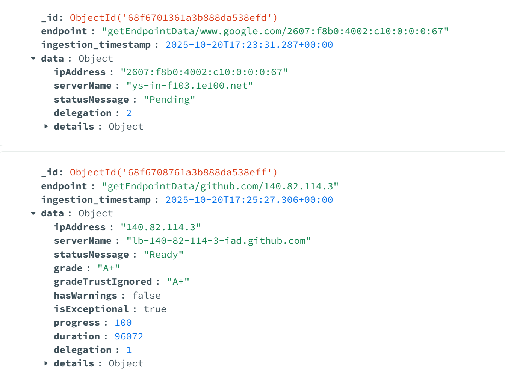
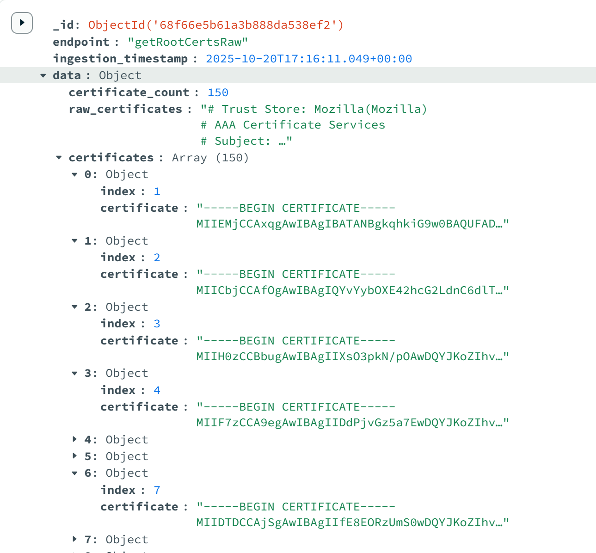

# SSL Labs API ETL Pipeline

A comprehensive **Python-based ETL (Extract, Transform, Load)** pipeline that connects to the **SSL Labs API** to extract SSL/TLS security configuration data, transform it for MongoDB compatibility, and load it into a MongoDB database for analysis and storage.

---

## Overview

This ETL connector extracts data from **5 different SSL Labs API endpoints:**

| # | Endpoint | Purpose | Data Scope |
|:-:|-----------|----------|-------------|
| 1 | `/info` | API version and engine information | Global |
| 2 | `/getStatusCodes` | Status code definitions | Global |
| 3 | `/analyze` | SSL/TLS configuration analysis | Per-host |
| 4 | `/getEndpointData` | Detailed endpoint information | Per-IP |
| 5 | `/getRootCertsRaw` | Trusted root certificates | Global |

---

## Project Goals

- Extract data from SSL Labs API with proper error handling
- Transform data by adding metadata (timestamps, endpoint info)
- Load data into separate MongoDB collections per endpoint
- Secure credentials using environment variables
- Handle rate limits, timeouts, and API errors gracefully  

---

## What is SSL Labs API?

**SSL Labs (by Qualys)** provides a free API to analyze the SSL/TLS configuration of public web servers, the same engine that powers the **SSL Server Test** tool.

### Key Features
- Free to use (no API key required)
- Analyzes SSL/TLS certificates, protocols, and ciphers
- Provides letter grades (A+, A, B, C, D, F)
- Identifies common vulnerabilities
- Trusted by security professionals worldwide

### Use Cases
- Monitor SSL/TLS configurations across infrastructure  
- Track certificate expirations  
- Identify vulnerabilities  
- Maintain compliance  
- Perform historical SSL/TLS security data analysis  

###  API Details
- **Base URL:** `https://api.ssllabs.com/api/v3`  
- **Authentication:** None (public API)  
- **Rate Limit:** 1 request per 2 seconds recommended  
- **Docs:** [Official API Documentation](https://github.com/ssllabs/ssllabs-scan/blob/master/ssllabs-api-docs-v3.md)  

---

## API Endpoints Explained

### 1.  `/info`
**URL:** `GET https://api.ssllabs.com/api/v3/info`

Retrieves API version and engine information.

**Extracted Fields:**
- API version number
- Engine version
- Max concurrent assessments
- Current assessments running
- API status

**MongoDB Collection:** `ssllabs_info_raw`

**Sample Response:**
```json
{
  "engineVersion": "2.2.0",
  "criteriaVersion": "2009q",
  "maxAssessments": 25,
  "currentAssessments": 0,
  "newAssessmentCoolOff": 1000
}
```

### 2.  `/getStatusCodes`
**URL:** `GET https://api.ssllabs.com/api/v3/getStatusCodes`

Retrieves all status codes and their meanings used by SSL Labs API.

**Extracted Fields:**
- Status codes
- Descriptions
- Categories

**MongoDB Collection:** `ssllabs_statuscodes_raw`

**Sample Response:**
```json
{
  "statusDetails": {
    "READY": "Assessment complete",
    "IN_PROGRESS": "Assessment in progress",
    "ERROR": "Assessment failed",
    "DNS": "Resolving DNS",
    "TESTING": "Testing endpoints"
  }
}

```

### 3.  `/analyze`
**URL:** `GET https://api.ssllabs.com/api/v3/analyze?host={hostname}&publish=off&startNew=on&all=done`

Performs SSL/TLS security analysis for a hostname.

**Parameters:**

- `host`: Required (e.g., www.google.com)
- `publish`: on/off
- `startNew`: on/off
- `all`: on/done

**Extracted Fields:**
- Grades (A+, A, B, etc.)
- Certificates, protocols, ciphers
- Vulnerabilities (Heartbleed, POODLE, etc.)
- Endpoints and HSTS config

**MongoDB Collection:** `ssllabs_hostanalysis_raw`

**Sample Response:**
```json
{
  "host": "www.google.com",
  "status": "READY",
  "endpoints": [
    {
      "ipAddress": "142.250.185.68",
      "grade": "A+"
    }
  ]
}
```
### 4.  `/getEndpointData`
**URL:** `GET https://api.ssllabs.com/api/v3/getEndpointData?host={hostname}&s={ip_address}`

Retrieves detailed SSL/TLS information for a specific IP address.

**Extracted Fields:**
- Certificate details
- Supported protocols and cipher suites
- Vulnerability tests (Heartbleed, POODLE, etc.)

**MongoDB Collection:** `ssllabs_endpointdata_raw`

**Sample Response:**
```json
{
  "ipAddress": "142.250.185.68",
  "grade": "A+",
  "details": {
    "protocols": [
      {"name": "TLS", "version": "1.2"},
      {"name": "TLS", "version": "1.3"}
    ]
  }
}
```

### 5.  `/getRootCertsRaw`
**URL:** `GET https://api.ssllabs.com/api/v3/getRootCertsRaw`

Retrieves trusted root certificates (in PEM format).

**Special Handling:** Returns plain text, not JSON.
**MongoDB Collection:** `ssllabs_rootcerts_raw`

**Sample Response:**
```
-----BEGIN CERTIFICATE-----
MIIDdzCCAl+gAwIBAgIEAgAAuTANBg...
-----END CERTIFICATE-----

```

**Transformed JSON:**
```json
{
  "endpoint": "getRootCertsRaw",
  "ingestion_timestamp": "2025-10-20T10:30:00.000Z",
  "data": {
    "certificate_count": 150,
    "certificates": [
      {
        "index": 1,
        "certificate": "-----BEGIN CERTIFICATE-----\\n..."
      }
    ]
  }
}

```

## Setup Instructions

### Step 1: Clone the Repository

```
git clone <repository-url>
cd ssl-labs-connector
```

### Step 2: Install Dependencies

```
pip install -r requirements.txt
```

### Step 3: Configure Environment Variables
Add `.env` file based on `ENV_TEMPLATE`

# MongoDB Collections

| **Collection Name**         | **Description**                 | **Data Scope** | **Expected Count** |
|-----------------------------|---------------------------------|----------------|--------------------|
| `ssllabs_info_raw`          | API version and engine info     | Global         | 1/run              |
| `ssllabs_statuscodes_raw`   | Status code definitions         | Global         | 1/run              |
| `ssllabs_hostanalysis_raw`  | SSL/TLS analysis results        | Per-host       | 1/host             |
| `ssllabs_endpointdata_raw`  | Detailed endpoint data          | Per-IP         | varies             |
| `ssllabs_rootcerts_raw`     | Trusted root certificates       | Global         | 1/run              |

---

#  ETL Pipeline Flow

## 1. EXTRACT
- API request with error handling  
- Rate limit management (**2 sec delay**)  
- Retry logic for **429 errors**  
- Response validation  

## 2. TRANSFORM
- Add `ingestion_timestamp`  
- Add `endpoint_identifier`  
- Parse raw PEM text  
- Structure data for MongoDB  

## 3. LOAD
- Establish MongoDB connection  
- Insert documents into the correct collection  
- Validate and confirm successful insertion  

---

#  Error Handling

### **Network Errors**
- Connection failures  
- Timeouts (**30s**)  
- DNS resolution issues  

### **API Errors**
| Error Code | Action |
|-------------|--------|
| **429** Too Many Requests | Auto-retry after 60s |
| **400** Bad Request | Logged and skipped |
| **500+** Server Errors | Logged and retried |

### **Data Errors**
- JSON decode failures  
- Empty responses  
- Invalid hostnames  

### **MongoDB Errors**
- Authentication or connection failures  
- Insertion issues  

---

#  Security Practices

- Credentials stored in `.env` (never in code)
- `.gitignore` prevents committing sensitive files
- No API key required (public API)
- Input validation for all parameters
- 30-second timeout protection  

---

#  Output Screenshots

##  MongoDB Collections Overview


---

##  `/info` — API Version and Engine Info


---

##  `/getStatusCodes` — Status Code Definitions


---

##  `/analyze` — SSL/TLS Host Analysis Results


---

##  `/getEndpointData` — Endpoint-Level Data


---

##  `/getRootCertsRaw` — Trusted Root Certificates



