# CERT.at Threat Intelligence ETL Pipeline - Assignmnent 2

**Student**: Ravindran V  
**Roll Number**: 3122225001701  
**Course**: Software Architecture   
**Assignment**: 2 - ETL Pipeline Implementation  


A comprehensive ETL (Extract, Transform, Load) pipeline for processing CERT.at threat intelligence data from both CSV feeds and RSS security updates.

##  Features

### CSV Threat Intelligence Pipeline
- **Malware Infections**: Tracks infected systems and C2 communications
- **Vulnerable Systems**: Identifies systems with known vulnerabilities
- **Brute Force Attacks**: Monitors brute force attack attempts
- **Data Normalization**: Standardizes threat data using ENISA taxonomy
- **Severity Classification**: Automatic threat severity assessment
- **Duplicate Detection**: Prevents duplicate records via unique identifiers

### RSS Security Feeds Pipeline
- **Security Warnings**: Critical security alerts from CERT.at
- **Blog Posts**: Security analysis and research (DE/EN)
- **Daily Reports**: Daily security summaries
- **Current News**: Latest security developments
- **Special Topics**: In-depth security analyses
- **HTML Cleaning**: Removes HTML tags and normalizes content

### Common Features
- **Unified Orchestration**: Run both pipelines together or separately
- **MongoDB Integration**: Efficient storage with proper indexing
- **Upsert Support**: Update existing records or insert new ones
- **Comprehensive Logging**: Detailed logs for troubleshooting
- **Error Handling**: Robust error handling with detailed reporting
- **Statistics**: Real-time processing statistics and summaries

##  Prerequisites

- Python 3.8 or higher
- MongoDB 4.4 or higher
- Internet connection (for RSS feeds)

##  Installation

### 1. Clone or Download the Project

```bash
# Create project directory
mkdir cert_at_pipeline
cd cert_at_pipeline
```

### 2. Set Up Python Virtual Environment

```bash
# Create virtual environment
python -m venv venv

# Activate virtual environment
# On Linux/Mac:
source venv/bin/activate
# On Windows:
venv\Scripts\activate
```

### 3. Install Dependencies

```bash
pip install -r requirements.txt
```

### 4. Install and Start MongoDB

**Option A: Using Docker (Recommended)**
```bash
docker run -d -p 27017:27017 --name mongodb mongo:latest
```

**Option B: Local Installation**
- Download from [MongoDB Download Center](https://www.mongodb.com/try/download/community)
- Follow installation instructions for your OS
- Start MongoDB service

### 5. Configure Environment Variables

```bash
# Copy template
cp .env.template .env

# Edit .env with your settings
nano .env
```

**Key Configuration Options:**

```bash
# MongoDB Connection
MONGO_URI=mongodb://localhost:27017/
DB_NAME=certat_intelligence_db

# Processing Limits
MAX_RECORDS_CSV=100
MAX_RECORDS_RSS=100

# Pipeline Control
RUN_CSV_PIPELINE=true
RUN_RSS_PIPELINE=true

# Data Management
CLEAN_BEFORE_LOAD=true  # Remove old data before loading
USE_UPSERT=false         # Update existing records vs fresh load
```

##  Generate Sample CSV Data

For testing the CSV pipeline without real data:

```bash
python scripts/generate_sample_data.py
```

This creates sample CSV files in the `data/` directory:
- `certat_malware_infections.csv` (30 records)
- `certat_vulnerable_systems.csv` (25 records)
- `certat_brute_force_attacks.csv` (20 records)

##  Usage

### Run Complete Pipeline

Process both CSV and RSS feeds:

```bash
python threat_intel_pipeline/etl_orchestrator.py
```

### Run Only CSV Pipeline

```bash
# Edit .env
RUN_CSV_PIPELINE=true
RUN_RSS_PIPELINE=false

python threat_intel_pipeline/etl_orchestrator.py
```

### Run Only RSS Pipeline

```bash
# Edit .env
RUN_CSV_PIPELINE=false
RUN_RSS_PIPELINE=true

python threat_intel_pipeline/etl_orchestrator.py
```

### Run Specific RSS Feeds

```bash
# Edit .env
RSS_FEEDS=warnings,blog_en,current

python threat_intel_pipeline/etl_orchestrator.py
```

##  Project Structure

```
threat_intel_pipeline/
├── __init__.py
├── csv_feeds/
│   ├── __init__.py
│   ├── extract.py      # CSV data extraction
│   ├── transform.py    # CSV data normalization
│   └── load.py         # CSV data loading to MongoDB
├── rss_feeds/
│   ├── __init__.py
│   ├── extract.py      # RSS feed fetching
│   ├── transform.py    # RSS data cleaning
│   └── load.py         # RSS data loading to MongoDB
└── etl_orchestrator.py # Main pipeline coordinator

data/                    # CSV feed files (generated)
logs/                    # Execution logs (auto-created)
scripts/                 # Utility scripts
.env                     # Configuration (create from template)
.env.template           # Configuration template
requirements.txt        # Python dependencies
README.md              # This file
```

##  MongoDB Collections

### CSV Threat Collections
- `threats_csv_malware_infections`: Malware infection records
- `threats_csv_vulnerable_systems`: Vulnerable system records
- `threats_csv_brute_force_attacks`: Brute force attack records

### RSS Feed Collections
- `rss_warnings`: Security warnings
- `rss_blog`: Blog posts (German)
- `rss_blog_en`: Blog posts (English)
- `rss_daily_reports`: Daily security reports
- `rss_current`: Current security news
- `rss_specials`: Special security topics

##  Data Schema

### CSV Threat Record
```json
{
  "record_id": "unique_hash",
  "feed_source": "malware_infections",
  "timestamp": "2024-01-15T10:30:00Z",
  "source": {
    "ip": "192.168.1.100",
    "port": "443",
    "fqdn": "infected.example.com",
    "geolocation": {
      "country_code": "AT",
      "city": "Vienna",
      "asn": "12345"
    }
  },
  "destination": {
    "ip": "10.0.0.1",
    "fqdn": "c2.malicious.com"
  },
  "classification": {
    "taxonomy": "malicious-code",
    "type": "infected-system",
    "identifier": "emotet-infection"
  },
  "malware": {
    "name": "Emotet",
    "md5": "abc123...",
    "sha256": "def456..."
  },
  "severity": "high",
  "processed_at": "2024-01-15T10:35:00Z",
  "loaded_at": "2024-01-15T10:40:00Z"
}
```

### RSS Entry
```json
{
  "entry_id": "unique_hash",
  "feed_source": "warnings",
  "title": "Critical Security Alert",
  "link": "https://cert.at/alert/123",
  "content": "Full alert content...",
  "summary": "Brief summary...",
  "author": "CERT.at",
  "published": "2024-01-15T09:00:00Z",
  "tags": ["security", "alert", "critical"],
  "extracted_at": "2024-01-15T10:00:00Z",
  "loaded_at": "2024-01-15T10:05:00Z"
}
```

##  Querying Data

### Using MongoDB Shell

```javascript
// Connect to database
use certat_intelligence_db

// Count threat records by severity
db.threats_csv_malware_infections.aggregate([
  { $group: { _id: "$severity", count: { $sum: 1 } } }
])

// Find recent high-severity threats
db.threats_csv_malware_infections.find({
  severity: "high"
}).sort({ timestamp: -1 }).limit(10)

// Search RSS entries
db.rss_warnings.find({
  $text: { $search: "ransomware" }
})

// Get latest security warnings
db.rss_warnings.find().sort({ published: -1 }).limit(5)
```

### Using Python

```python
from pymongo import MongoClient

client = MongoClient('mongodb://localhost:27017/')
db = client['certat_intelligence_db']

# Get all high-severity threats
high_threats = db.threats_csv_malware_infections.find({
    'severity': 'high'
})

for threat in high_threats:
    print(f"{threat['timestamp']}: {threat['classification']['type']}")

# Search warnings
warnings = db.rss_warnings.find({
    '$text': {'$search': 'vulnerability'}
}).limit(10)
```

##  Monitoring and Logs

Logs are stored in the `logs/` directory with timestamps:
```
logs/etl_run_20240115_103045.log
```

### Log Levels
- **INFO**: Normal operation, statistics, progress
- **WARNING**: Non-critical issues, missing data
- **ERROR**: Processing errors, failures
- **CRITICAL**: Fatal errors that stop the pipeline


##  Advanced Configuration

### Upsert Mode

To update existing records instead of recreating collections:

```bash
# In .env
CLEAN_BEFORE_LOAD=false
USE_UPSERT=true
```

**Use Cases:**
- Continuous data updates
- Incremental loading
- Preserving historical data with updates

### Selective Pipeline Execution

Run only specific feeds:

```python
# Custom script
from threat_intel_pipeline.etl_orchestrator import ETLOrchestrator

config = {
    'mongo_uri': 'mongodb://localhost:27017/',
    'db_name': 'my_db',
    'max_records_csv': 50,
    'max_records_rss': 50,
    'run_csv': True,
    'run_rss': False,
    'csv_data_dir': 'custom_data/'
}

orchestrator = ETLOrchestrator(config)
results = orchestrator.run()
```

##  Troubleshooting

### MongoDB Connection Error

```
Error: ServerSelectionTimeoutError
```

**Solutions:**
- Verify MongoDB is running: `sudo systemctl status mongod`
- Check connection string in `.env`
- Ensure port 27017 is accessible
- Try: `mongosh` to test connection

### CSV File Not Found

```
Error: File not found: data/certat_malware_infections.csv
```

**Solutions:**
- Generate sample data: `python scripts/generate_sample_data.py`
- Check CSV_DATA_DIR in `.env`
- Verify file permissions

### RSS Feed Fetch Error

```
Error: No entries found in feed: warnings
```

**Solutions:**
- Check internet connection
- Verify CERT.at is accessible: `curl https://www.cert.at`
- Some feeds may be temporarily unavailable
- Try fetching other feeds

### Import Errors

```
ModuleNotFoundError: No module named 'pymongo'
```

**Solutions:**
- Activate virtual environment
- Install dependencies: `pip install -r requirements.txt`
- Verify Python version: `python --version` (3.8+)

## 📚 API Reference

### CSV Extractor

```python
from threat_intel_pipeline.csv_feeds import CSVExtractor

extractor = CSVExtractor(data_dir='data')

# Extract single feed
data = extractor.extract_feed('malware_infections')

# Extract all feeds
all_data = extractor.extract_all_feeds()

# Validate feed files exist
validation = extractor.validate_feed_files()
```

### RSS Extractor

```python
from threat_intel_pipeline.rss_feeds import RSSExtractor

extractor = RSSExtractor(timeout=30)

# Fetch single feed
data = extractor.fetch_feed('warnings')

# Fetch specific feeds
data = extractor.fetch_specific_feeds(['warnings', 'blog_en'])

# Get available feeds
feeds = extractor.get_available_feeds()
```

##  Resources

- [CERT.at Official Website](https://www.cert.at/)
- [CERT.at Data Services](https://www.cert.at/en/services/data/)
- [MongoDB Documentation](https://www.mongodb.com/docs/)
- [Python feedparser](https://feedparser.readthedocs.io/)

## Output Screenshots
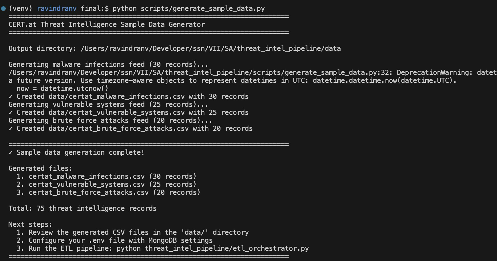
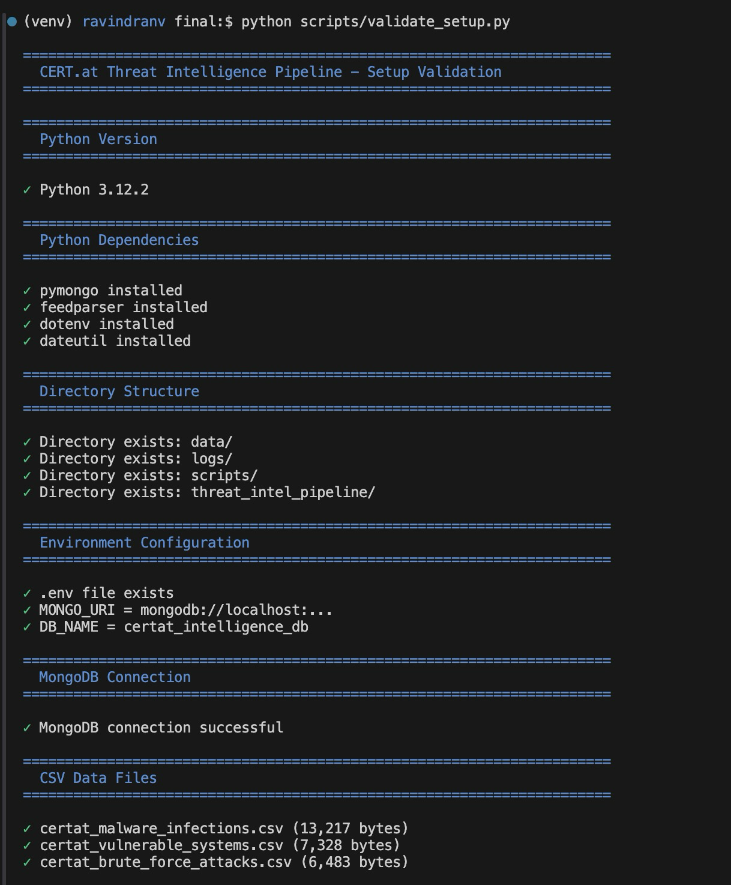
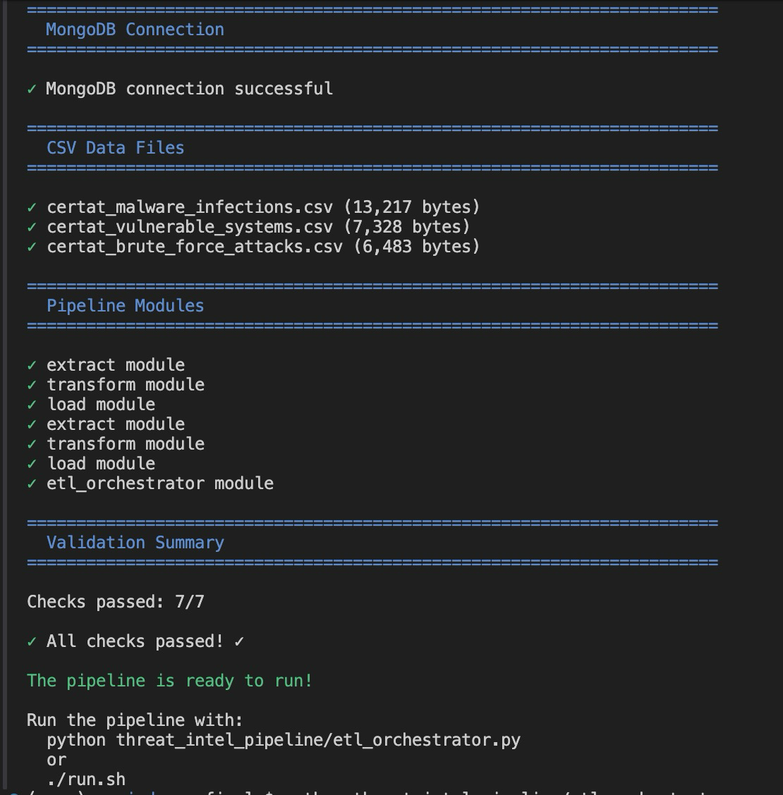  
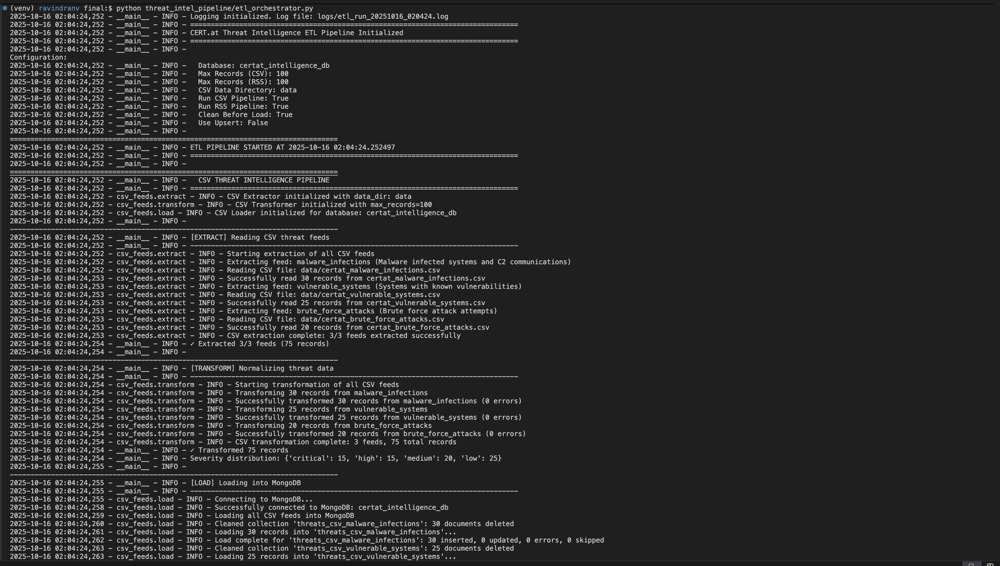
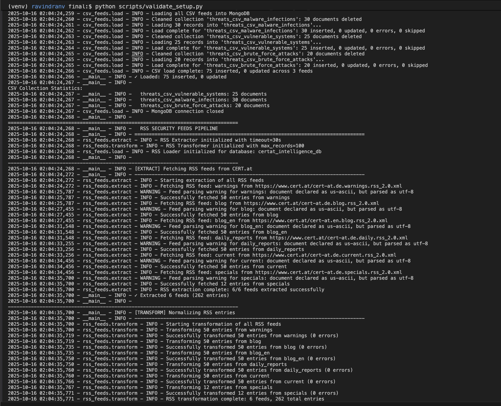

**Using ./run.sh**
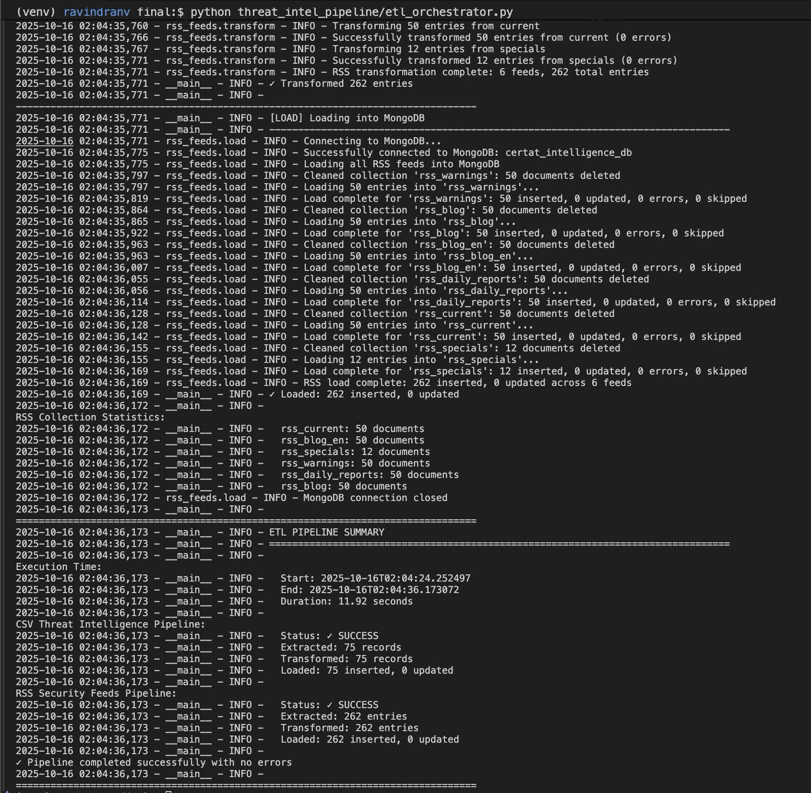
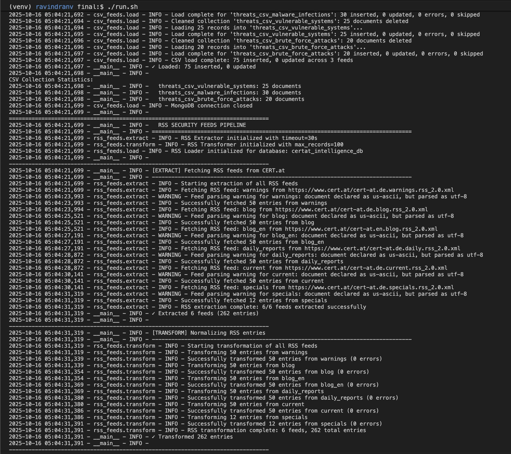

**MongoDB**:
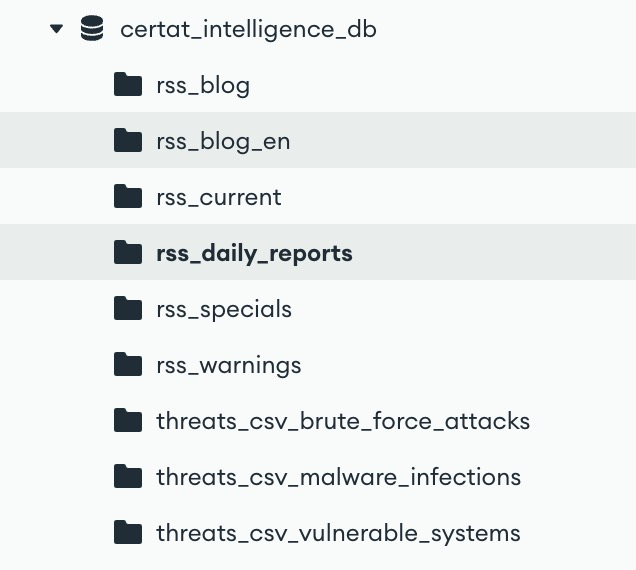
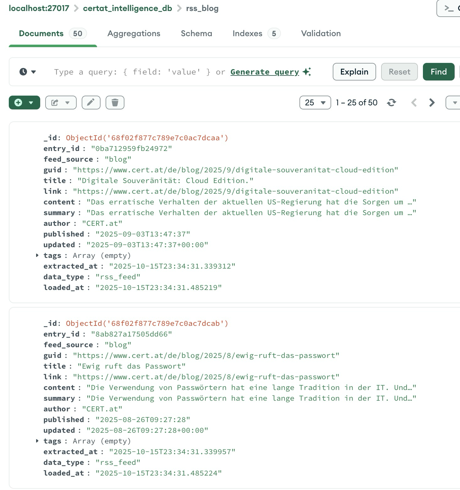
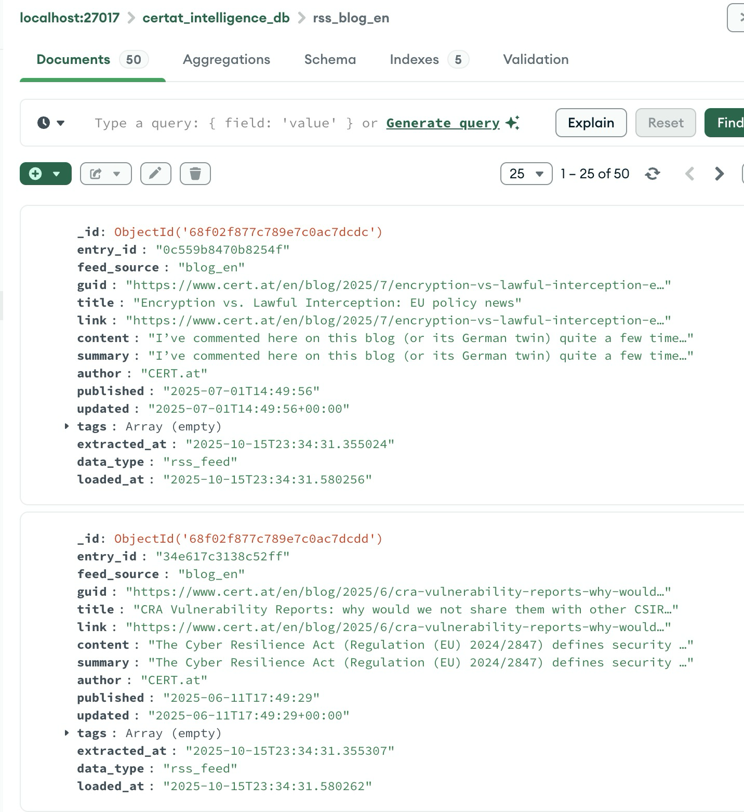
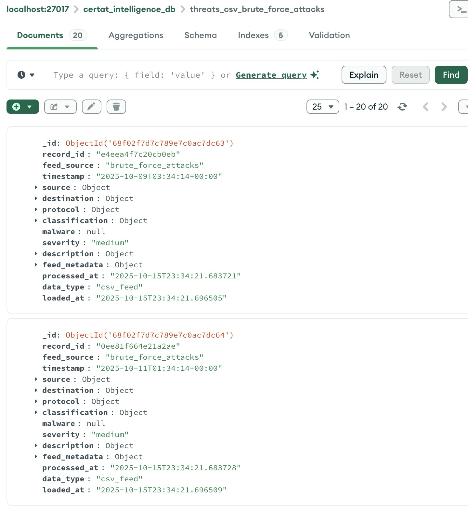
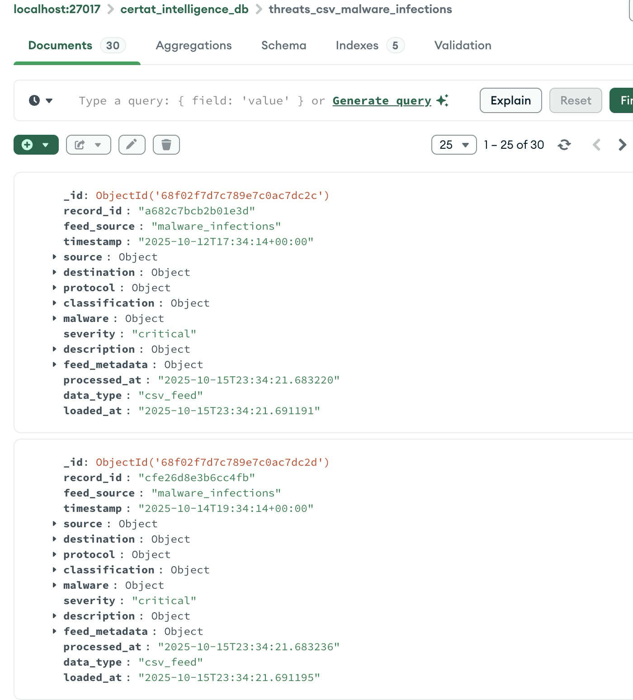

## Important Notes

- **Data Freshness**: RSS feeds are live; CSV feeds require manual updates
- **Rate Limiting**: Respect CERT.at servers; avoid excessive requests
- **Data Privacy**: Handle threat intelligence data responsibly
- **Storage**: Monitor MongoDB disk usage for large datasets
- **Backups**: Implement regular MongoDB backups for production use

---
**Student**: Ravindran V  
**Roll Number**: 3122225001701  
**Course**: Software Architecture   
**Assignment**: 2 - ETL Pipeline Implementation  