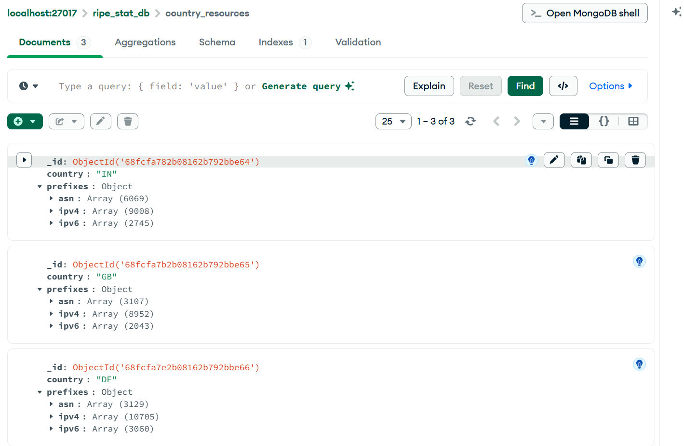
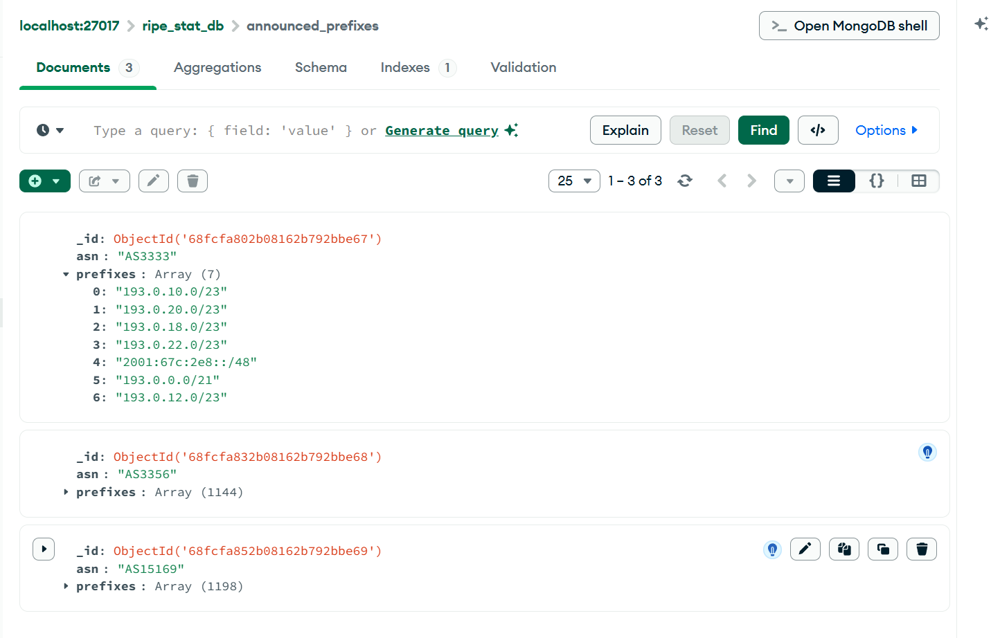
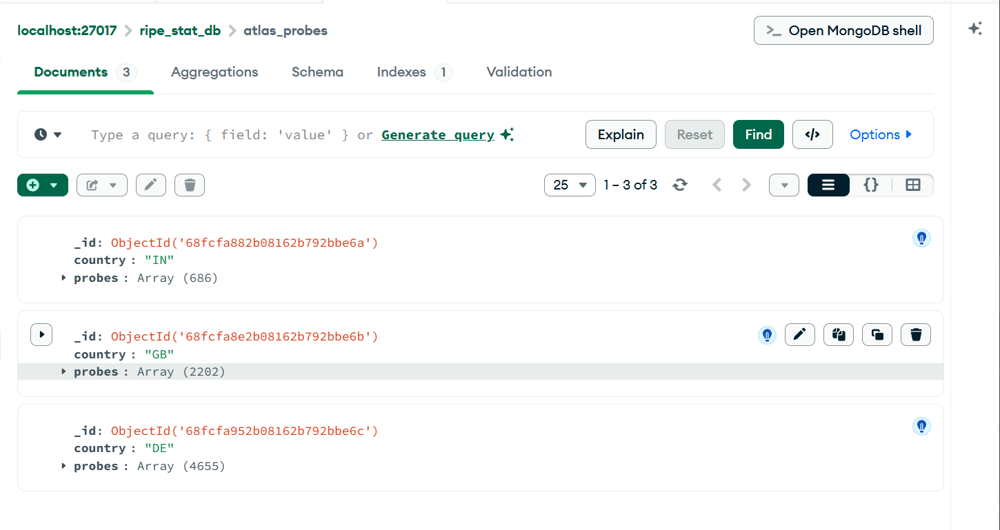
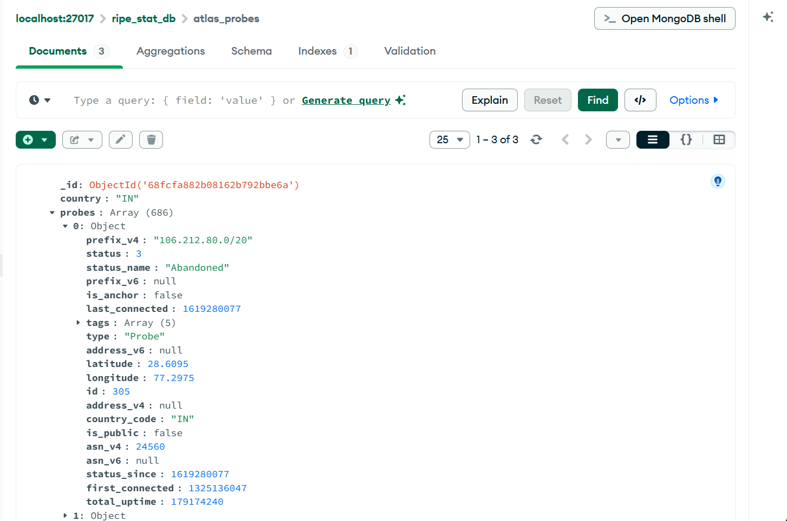

# Custom Python ETL Connector for RIPEstat Data

## Overview
This ETL script extracts network and internet resource data from **RIPEstat API endpoints** for a set of countries and ASNs, transforms the data into a structured format, and loads it into **MongoDB** collections.

## Environment Variables
Create a `.env` file with the given template.

**Important:** Do not commit `.env` to Git.

## Setup
1. Clone the repository and create your branch.
2. Create and fill the `.env` file.
3. Install dependencies:

```bash
pip install -r requirements.txt
````

## Usage

Run the ETL connector:

```bash
python etl_connector.py
```

## Script Overview

The script will:

* Query the following RIPEstat endpoints:

  * Country Resource List (for IN, GB, DE)
  * Announced Prefixes (for selected ASNs)
  * Atlas Probes
* Transform responses into structured dictionaries:

  * `country` or `ASN`
  * `prefixes` or `probes`
  * `status` (if available)
  * `resource` (country code or ASN)
* Load the data into separate MongoDB collections.

Duplicates are avoided by updating existing records based on `country` or `ASN`.

## Git Guidelines

* Do not commit `.env`.
* Write clear commit messages (include your name and roll number if required).
* Push to your branch and submit a Pull Request when done.

## Output Screenshots

### Country Resource List



### Announced Prefixes



### Atlas Probes





