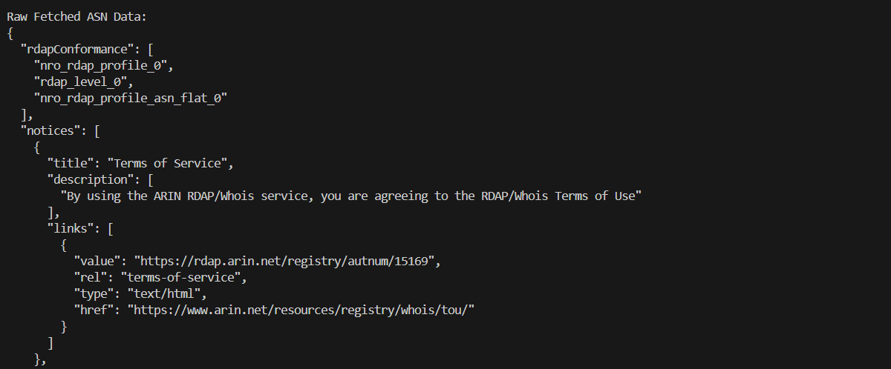
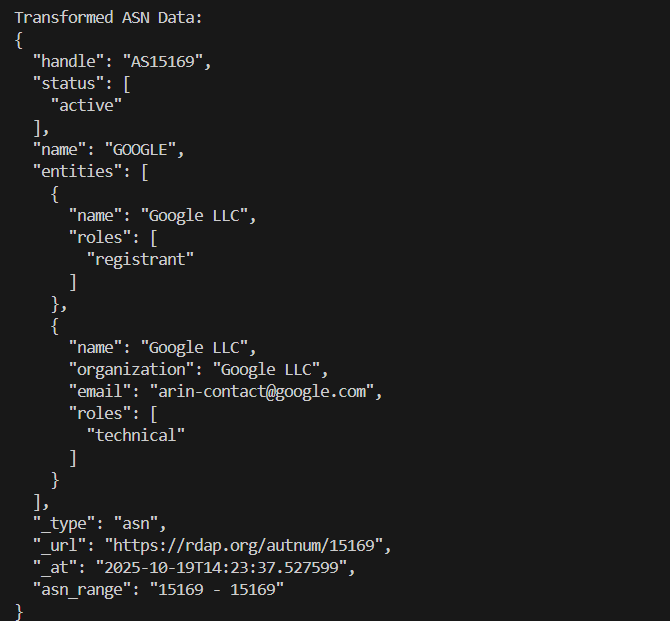
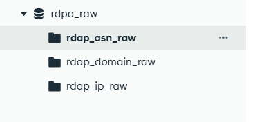
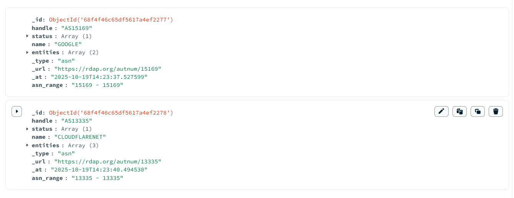

# RDAP ETL Pipeline  

An ETL (Extract–Transform–Load) pipeline that fetches RDAP (Registration Data Access Protocol) data for **domains, IP addresses, and ASNs**, transforms it into a simplified format, and stores it in **MongoDB** for further analysis.  

---

## 📖 Overview  

This project demonstrates a complete ETL process using Python:  
- **Extract:** Fetch RDAP data from `rdap.org` API for domains, IPs, and ASNs.  
- **Transform:** Normalize and extract useful fields (e.g., handle, status, entities, nameservers).  
- **Load:** Store cleaned data into MongoDB collections for easy querying.  
- **Validation:** Built-in pipeline tests handle invalid inputs, API errors, and empty responses.  

---

## ✨ Features  

- Fetch RDAP data for **Domains, IPs, and ASNs**.  
- Automatic **retry and backoff** on API rate limits or network errors.  
- **Data transformation** (flattened entities, trimmed keys).  
- **MongoDB storage** with separate collections (`rdap_domain_raw`, `rdap_ip_raw`, `rdap_asn_raw`).  
- Validation tests for:  
  - Invalid/edge-case inputs  
  - Empty responses  
  - MongoDB insertion checks  
- Example outputs displayed for clarity (one per type).  

---

## ⚙️ Requirements  

- Python 3.8+  
- MongoDB (local or cloud instance)  
- Dependencies (installed via `pip`):  
  - `requests`  
  - `pymongo`  
  - `python-dotenv`  

---

## 📦 Installation  

1. Clone the repository:  
   ```bash
   git clone https://github.com/yourusername/rdap-etl-pipeline.git
   cd rdap-etl-pipeline
   ```

2. Create a virtual environment and activate it:  
   ```bash
   python -m venv venv
   source venv/bin/activate   # On macOS/Linux
   venv\Scripts\activate      # On Windows
   ```

3. Install dependencies:  
   ```bash
   pip install -r requirements.txt
   ```

---

## 🔑 Environment Variables  

Create a `.env` file in the project root:  

```env
MONGO_URI=mongodb://localhost:27017/
DB_NAME=rdap_db
```

Defaults are used if not provided:  
- `MONGO_URI` → `<MONGO DB URI>`
- `DB_NAME` → `DB name` 
must be set in `.env`  

---

## 🚀 Usage  

Run the ETL pipeline:  
```bash
python etl_connector.py
```

This will:  
1. Fetch RDAP data for sample domains, IPs, and ASNs.  
2. Transform and display one sample record per type.  
3. Insert all records into MongoDB.  
4. Run validation tests.  

---

## 🌐 API Endpoints Used  

Data is fetched from **[RDAP.org](https://rdap.org/)**:  
- Domain: `https://rdap.org/domain/{domain}`  
- IP: `https://rdap.org/ip/{ip}`  
- ASN: `https://rdap.org/autnum/{asn}`  

---

## 📝 Example Output 
Raw ASN data:

[](output_images/raw_asn_data.png)

Transformed ASN data:  
[](output_images/transformed_asn_data.png)

MongoDB collections:
[](output_images/mongo_collections.png)

MongoDB data Load:
[](output_images/mongo_data.png)

---

## 📜 License  

This project is licensed under the **MIT License** – you are free to use, modify, and distribute it.  

---

 
