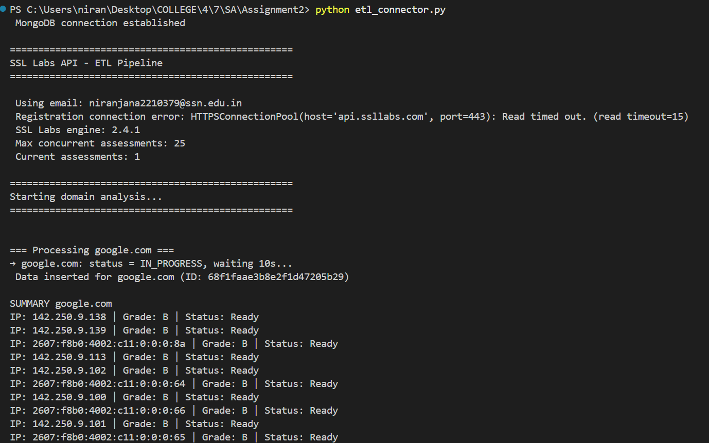
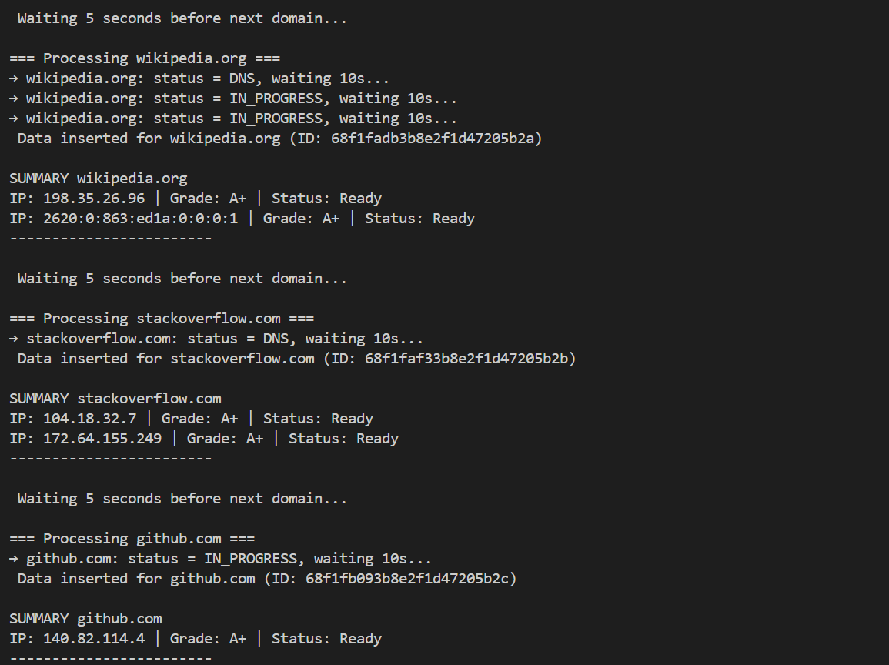
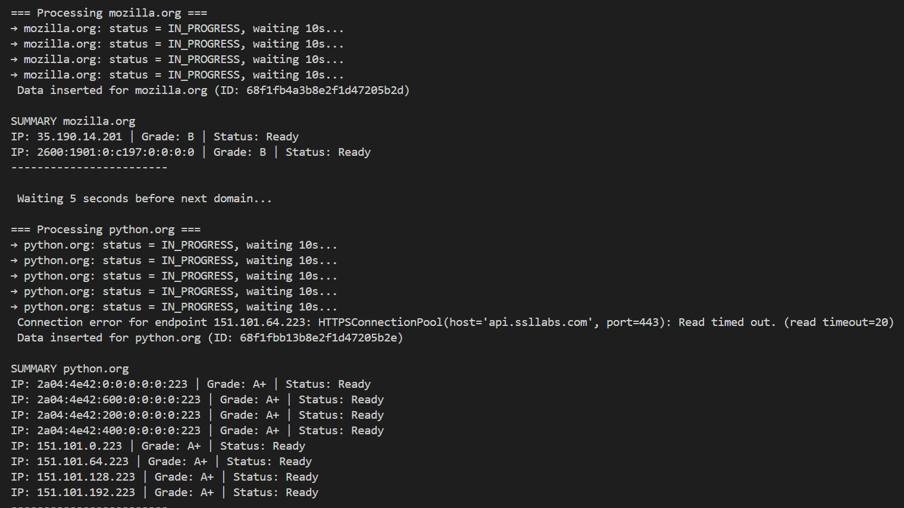
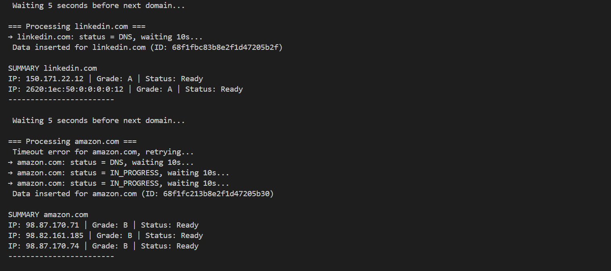
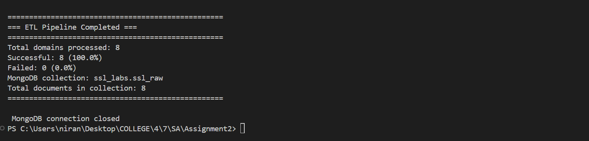
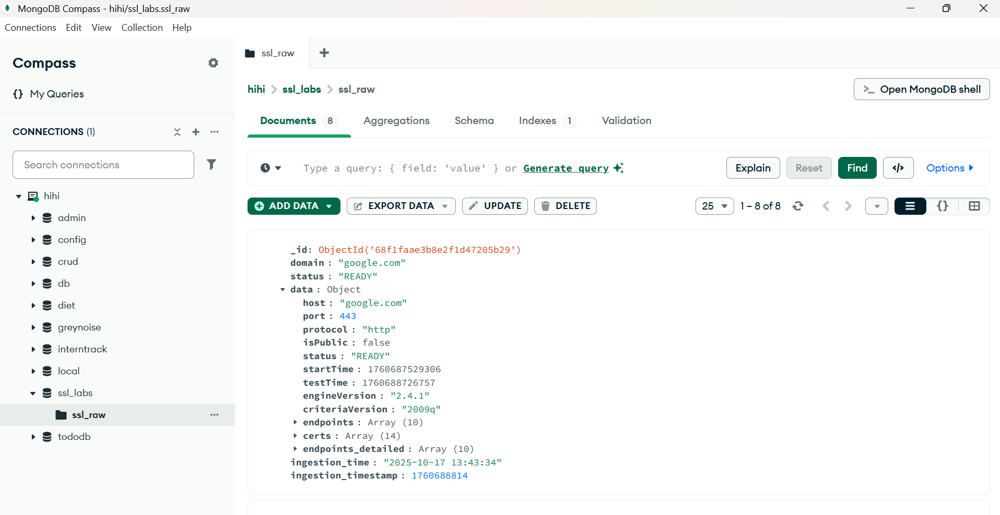
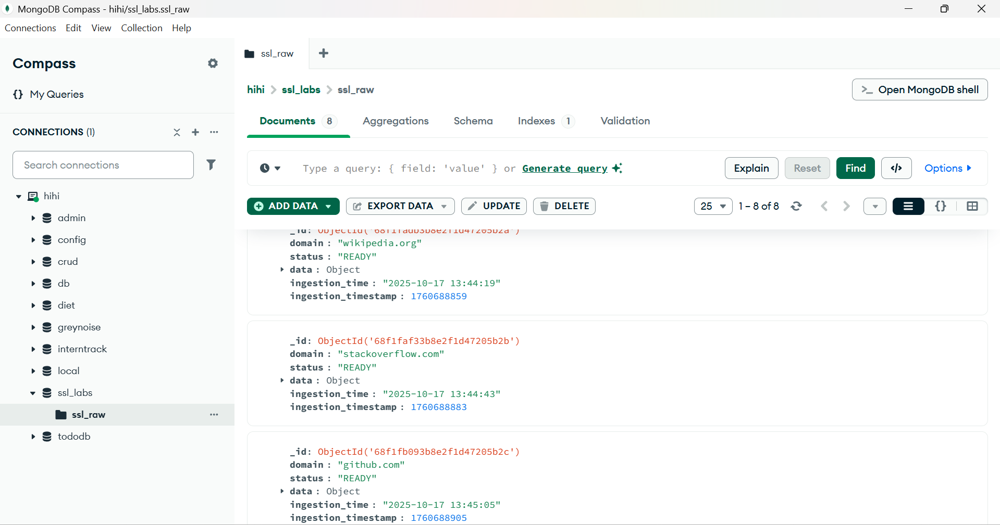
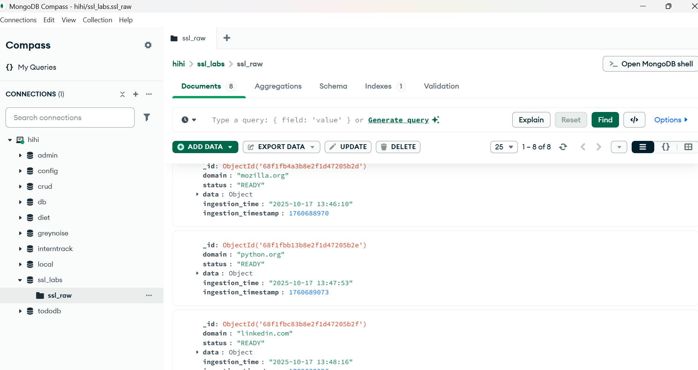
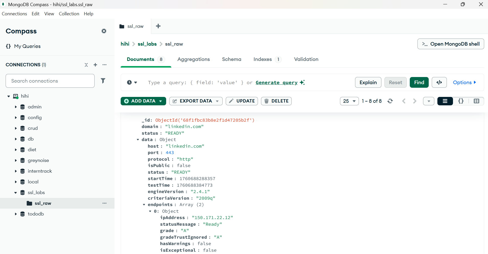
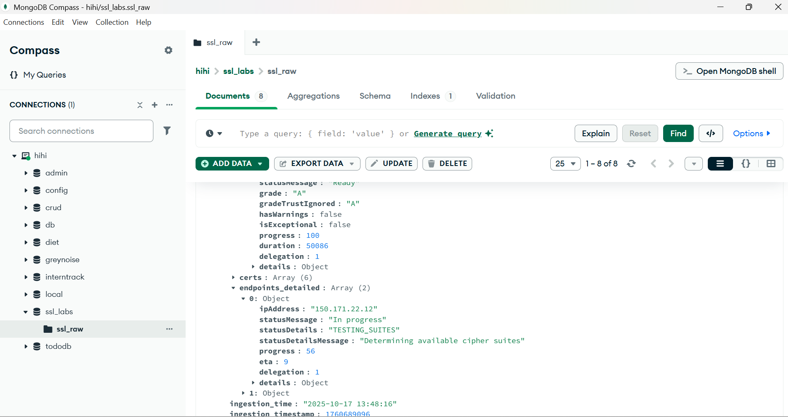

# Software Architecture - Assignment 2

**Niranjana A**  
**3122225001083**  
**CSE B**

---

## SSL Labs API Connector - ETL Pipeline

This ETL pipeline connects to the **Qualys SSL Labs API v4** to analyze SSL/TLS configurations of multiple domains and stores comprehensive security assessment results in MongoDB. The pipeline extracts SSL/TLS configuration data, transforms it into a structured format, and loads it into a MongoDB collection for further analysis.

---

## API Provider Details

- **Provider**: Qualys SSL Labs
- **Base URL**: `https://api.ssllabs.com/api/v4`
- **Documentation**: [SSL Labs API v4 Documentation](https://github.com/ssllabs/ssllabs-scan/blob/master/ssllabs-api-docs-v4.md)
- **Authentication Method**: Email-based registration (header-based auth)
- **Rate Limits**: 
  - Concurrent assessments limited per user
  - Cool-off period between new assessments
  - Polling recommended at 10-second intervals

---

## Endpoints Used

| Endpoint | Method | Purpose | Parameters |
|----------|--------|---------|------------|
| `/register` | POST | Register email for API access | firstName, lastName, email, organization |
| `/info` | GET | Get API server information | None |
| `/analyze` | GET | Initiate and monitor domain analysis | host, startNew, all (header: email) |
| `/getEndpointData` | GET | Fetch detailed endpoint information | host, s (IP address) (header: email) |

---

## Project Structure

```
custom-python-etl-data-connector-nna-12/
├── etl_connector.py       # Main ETL script
├── ENV_TEMPLATE           # Template for environment variables
├── .gitignore             # Ignore .env and unnecessary files
├── requirements.txt       # Python dependencies
└── README.md              # Project documentation
```

---

## Setup Instructions

### 1. Prerequisites

- Python 3.8 or higher
- MongoDB installed and running
- Organization email address 

### 2. Clone Repository

```bash
git clone <repository-url>
cd <your-branch-name>
```

### 3. Install Dependencies

```bash
pip install -r requirements.txt
```

### 4. Configure Environment Variables

Create a `.env` file in the project root:

```env
EMAIL=your_email@organization.com
MONGO_URI=mongodb://localhost:27017/
```

### 5. Register Your Email (First Time Only)

The script automatically handles registration. On first run, it will register your email with SSL Labs. Subsequent runs will use the registered email.

### 6. Run the ETL Pipeline

```bash
python etl_connector.py
```
---

## MongoDB Schema

### Database Configuration
- **Database Name**: `ssl_labs`
- **Collection Name**: `ssl_raw`

### Document Structure

```json
{
  "_id": ObjectId("..."),
  "domain": "example.com",
  "status": "READY",
  "data": {
    "host": "example.com",
    "port": 443,
    "protocol": "http",
    "isPublic": false,
    "status": "READY",
    "statusMessage": "Ready",
    "startTime": 1697558400000,
    "testTime": 1697558460000,
    "engineVersion": "2.2.0",
    "criteriaVersion": "2009l",
    "endpoints": [
      {
        "ipAddress": "93.184.216.34",
        "serverName": "example.com",
        "statusMessage": "Ready",
        "grade": "A+",
        "gradeTrustIgnored": "A+",
        "hasWarnings": false,
        "isExceptional": true,
        "progress": 100,
        "delegation": 1
      }
    ],
    "endpoints_detailed": [
      {
        "ipAddress": "93.184.216.34",
        "serverName": "example.com",
        "protocols": [...],
        "suites": [...],
        "serverSignature": "...",
        "vulnBeast": false,
        "heartbleed": false,
        "freak": false,
        "poodle": false,
        "hstsPolicy": {...},
        ...
      }
    ],
    "certs": [...]
  },
  "ingestion_time": "2025-10-17 14:30:00",
  "ingestion_timestamp": 1697558400
}
```

---

## Features

- **Extract**: Connects to SSL Labs API with proper authentication
- **Transform**: Structures data with metadata and timestamps
- **Load**: Inserts into MongoDB with error handling

---

## Testing & Validation

### Test Domains

The pipeline is pre-configured to test 8 major domains:

1. google.com
2. wikipedia.org
3. stackoverflow.com
4. github.com
5. mozilla.org
6. python.org
7. linkedin.com
8. amazon.com

### Validation Checks

- Email format validation
- Environment variable presence check
- MongoDB connection test before processing
- Response structure validation
- Empty payload detection
- Invalid data handling

---

## Error Scenarios Handled

| Error Type | Status Code | Handling Strategy |
|------------|-------------|-------------------|
| Rate Limit Exceeded | 429 | Wait 60 seconds, retry |
| Service Overloaded | 529 | Wait 15 minutes, retry |
| Service Unavailable | 503 | Wait 15 minutes, retry |
| Unauthorized | 441 | Log error, skip domain |
| Connection Timeout | - | Retry with 5s delay |
| Invalid Response | - | Log error, skip domain |
| Empty Payload | - | Validate and skip |
| MongoDB Insertion Fail | - | Log error, continue pipeline |

---

## Output Screenshots

### Terminal Output






### MongoDB Document View






---
