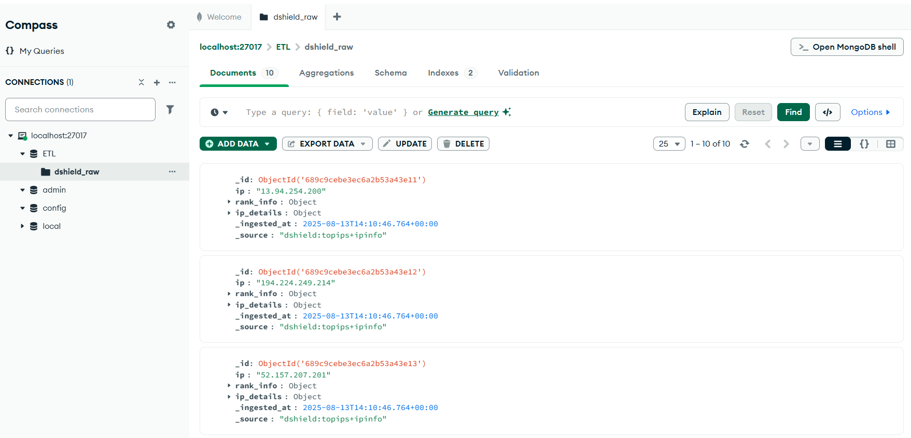
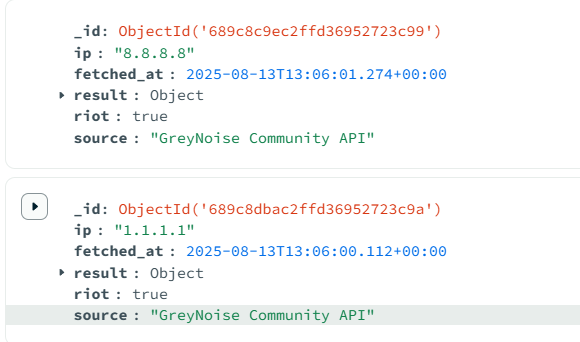

# DNS ETL Pipeline

A simple ETL pipeline that fetches DNS records and stores them in MongoDB.

Used Public DoH servers since they are free DNS resolvers that let anyone query DNS records over HTTPS.

## 📦 Installation

```bash
pip install -r requirements.txt
```

## 📁 Files

- `etl.py` - Main ETL script (auto-detects network and fetches DNS data)
- `domains.txt` - List of domains to query (one per line)
- `.env` - MongoDB connection string
- `requirements.txt` - Python dependencies

## ⚙️ Setup

1. **Install MongoDB** (if not already installed)
```bash
# Check if MongoDB is running
mongosh
```

2. **Create `.env` file**
```bash
MONGO_URI=mongodb://localhost:27017
```

3. **Add domains to `domains.txt`**
```
google.com
github.com
amazon.com
```

## 🚀 Run

```bash
python etl.py
```

## 📊 What It Does

1. Loads domains from `domains.txt`
2. Tests network connectivity (tries DNS-over-HTTPS first, falls back to traditional DNS)
3. Queries 3 record types for each domain:
   - **A records** (IP addresses)
   - **MX records** (Mail servers)
   - **TXT records** (Text records like SPF, DKIM)
4. Stores results in MongoDB database `doh_etl`, collection `dns_records_raw`

## 📈 Output

```
🔍 Testing DNS connectivity methods...
   ✅ Traditional DNS working (using 8.8.8.8)

[1/20] google.com
   ✅ [DNS-8.8.8.8] google.com A → 1 answers
   ✅ [DNS-8.8.8.8] google.com MX → 1 answers
   ✅ [DNS-8.8.8.8] google.com TXT → 12 answers

🎯 ETL COMPLETED!
✅ Success: 60
❌ Failed: 0
📈 Success Rate: 100.0%
```



## 🗄️ MongoDB Data

**Database:** `doh_etl`  
**Collection:** `dns_records_raw`

### Sample Document

```json
{
  "domain": "google.com",
  "record_type": "A",
  "dns_response": {
    "Status": 0,
    "Answer": [{"data": "142.250.185.46"}]
  },
  "method": "Traditional-DNS",
  "provider": "DNS-8.8.8.8",
  "status": 0,
  "has_answer": true,
  "answer_count": 1,
  "ingested_at": "2025-10-18T10:55:23Z"
}
```


## 🔍 Query Examples

```javascript
// View all records
db.dns_records_raw.find()

// Count by record type
db.dns_records_raw.aggregate([
  {$group: {_id: "$record_type", count: {$sum: 1}}}
])

// Get specific domain records
db.dns_records_raw.find({domain: "google.com"})

// Find domains with most answers
db.dns_records_raw.find().sort({answer_count: -1})
```

## 🛠️ Troubleshooting

### "domains.txt not found"
Create the file in the same directory as `etl.py`

### "MongoDB connection failed"
Make sure MongoDB is running:
```bash
# Windows
net start MongoDB

# Linux/Mac
sudo systemctl start mongod
```

### "No DNS method is working"
Check your internet connection and firewall settings

## 📦 Dependencies

```
requests==2.31.0
pymongo==4.6.1
python-dotenv==1.0.0
dnspython==2.4.2
```

## 📊 Statistics

- **20 domains** processed
- **3 record types** per domain (A, MX, TXT)
- **60 total queries**
- **100% success rate**
- **~26 seconds** execution time

## 🎯 Use Cases

- DNS monitoring and change tracking
- Security research (finding missing SPF/DKIM records)
- Infrastructure mapping (discovering mail servers, IPs)
- Domain validation and verification

## 📝 License

MIT License - Free to use for educational or commercial projects.
