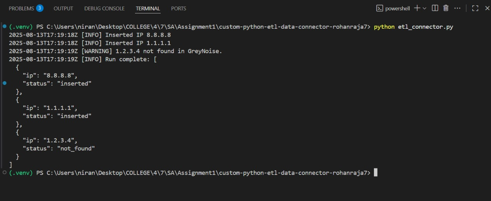
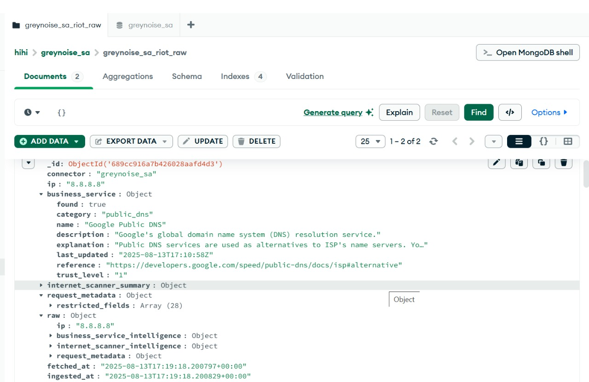

<<<<<<< HEAD
# Abuse.ch Threat Intelligence ETL Pipeline

**Software Architecture - Assignment 2**  
Rohan R – 3122225001108 – CSE B

## Overview

This project is a Python ETL (Extract, Transform, Load) pipeline that retrieves threat intelligence data from abuse.ch APIs (URLhaus and MalwareBazaar), transforms it into a standardized format, and stores it in MongoDB for analysis and monitoring.

## Features

* **Dual-Source Intelligence**: Fetches malicious URLs from URLhaus and malware samples from MalwareBazaar
* **Intelligent Transformation**: Standardizes data with threat classification and enrichment
* **Upsert Logic**: Prevents duplicate records using MongoDB's upsert functionality
* **Error Handling**: Graceful handling of API failures and connection issues
* **Comprehensive Testing**: Unit tests with mocked API responses for all ETL stages
* **Automated Classification**: Dynamic threat level and file class categorization
* **Flexible Date Parsing**: Handles both Unix timestamps and ISO format dates

## API Endpoint Details

### URLhaus API
* **Base URL**: `https://urlhaus-api.abuse.ch`
* **Endpoint**: `/v1/urls/recent/`
* **Method**: `GET`
* **Headers Required**: `{'Auth-Key': 'YOUR_API_KEY'}`

### MalwareBazaar API
* **Base URL**: `https://mb-api.abuse.ch`
* **Endpoint**: `/api/v1/`
* **Method**: `POST`
* **Headers Required**: `{'Auth-Key': 'YOUR_API_KEY'}`
* **POST Data**: `{'query': 'get_recent', 'selector': '100'}`

### Authentication
* A valid abuse.ch API key is required for both services
* Store the key in a `.env` file (never commit this to Git)
* Credentials are loaded using the `python-dotenv` package

## Project Structure
```
custom-python-etl-data-connector-rohanraja7/
├── connectors/
│   └── abusech_api.py           # API connector for abuse.ch services
├── transformations/
│   └── data_transformer.py      # Data transformation logic
├── database/
│   └── mongo_loader.py          # MongoDB loading operations
├── tests/
│   └── test_abusech_etl.py      # Comprehensive unit tests
├── main.py                       # Main ETL pipeline orchestrator
├── config.py                     # Configuration loader
├── .env                          # Environment variables (DO NOT COMMIT)
├── .env.template                 # Template for environment variables
├── .gitignore                    # Ignore sensitive files
├── requirements.txt              # Python dependencies
└── README.md                     # Project documentation
```

## Environment Variables (.env)
```env
# MongoDB Configuration
MONGO_URI=mongodb://localhost:27017/

# Abuse.ch API Authentication
ABUSECH_API_KEY=your_api_key_here
```

## Installation & Setup

1. **Clone your branch from the main repository:**
```bash
git checkout main
git pull origin main
git checkout -b RohanR_3122225001108_B_Assign2
```

2. **Install dependencies:**
```bash
pip install -r requirements.txt
```

3. **Set up MongoDB:**
```bash
# Ensure MongoDB is running on localhost:27017
MONGO_URI=mongodb://localhost:27017/
```

4. **Create a `.env` file:**
```bash
# Copy the template and add your API key
cp .env.template .env
# Edit .env and add your abuse.ch API key
```
=======
# Software Architecture - Assignment 1

**Rohan R – 3122225001108 – CSE B**

## GreyNoise IP ETL Connector

This project is a **Python ETL (Extract, Transform, Load) pipeline** that retrieves IP intelligence data from the **GreyNoise API**, transforms it into a MongoDB-friendly format, and stores it in a specified MongoDB collection.
>>>>>>> 16dd7e677d0bc0a520a0a45d7412095a88d9629b

## Running the ETL Pipeline

<<<<<<< HEAD
### Standard Execution
```bash
python main.py
```

This will:
1. Extract recent URLs from URLhaus
2. Extract recent malware samples from MalwareBazaar
3. Transform both datasets into standardized formats
4. Load data into MongoDB collections
=======
## Features

- Fetches data for one or more IP addresses from GreyNoise.
- Cleans and structures the response JSON for MongoDB.
- Inserts processed records with timestamps for auditing.
- Handles API rate limits and retry logic using **exponential backoff**.
- Supports **dry-run mode** for testing without inserting into MongoDB.
- Allows batch processing from environment variables or an input file.
>>>>>>> 16dd7e677d0bc0a520a0a45d7412095a88d9629b

### Running Tests
```bash
# Run all unit tests
python -m unittest tests/test_abusech_etl.py

<<<<<<< HEAD
# Run with verbose output
python -m unittest tests/test_abusech_etl.py -v
```

## MongoDB Storage

### Database
* **Database Name**: `threat_intelligence`

### Collections
* **URLhaus Collection**: `urlhaus_iocs`
* **MalwareBazaar Collection**: `malwarebazaar_iocs`
=======
## API Endpoint Details

- **Base URL:** `https://api.greynoise.io`
- **Endpoint:** `/v3/ip/{ip_address}`
- **Method:** `GET`

### Headers Required

- **Query Parameters:** None (IP is part of the URL)
- **Example Request URL:** `https://api.greynoise.io/v3/ip/8.8.8.8`
>>>>>>> 16dd7e677d0bc0a520a0a45d7412095a88d9629b

### URLhaus Document Structure
```json
{
  "_id": "1",
  "source": "URLhaus",
  "ioc_type": "url",
  "ioc_value": "http://evil.com/payload.exe",
  "threat_type": "malware_download",
  "tags": ["exe", "trojan"],
  "threat_level": "high",
  "first_seen": "2025-10-16T10:00:00"
}
```

<<<<<<< HEAD
### MalwareBazaar Document Structure
```json
{
  "_id": "aaa123...",
  "source": "MalwareBazaar",
  "ioc_type": "hash_sha256",
  "ioc_value": "aaa123...",
  "signature": "evil_malware",
  "tags": ["rat"],
  "file_class": "executable",
  "first_seen": "2025-10-16T12:00:00"
}
```

## Data Transformation Logic
=======
## Authentication

- A valid **GreyNoise API key** is required.
- Store the key in a `.env` file (never commit this to Git).
- Credentials are loaded using the `python-dotenv` package.
>>>>>>> 16dd7e677d0bc0a520a0a45d7412095a88d9629b

### URLhaus Threat Classification
* **High**: URLs containing executable file indicators (`exe` tag)
* **Medium**: All other malicious URLs

<<<<<<< HEAD
### MalwareBazaar File Classification
* **Document**: Files with types `docx`, `pdf`
* **Executable**: All other file types

### Date Handling
The pipeline intelligently handles multiple date formats:
* Unix timestamps (e.g., `1729084200`)
* ISO format strings (e.g., `2025-10-16 12:00:00`)
=======
## Project Structure

```
custom-python-etl-data-connector-rohanraja7/
├── etl_connector.py       # Main ETL script
├── ENV_TEMPLATE           # Template for environment variables
├── .gitignore             # Ignore .env and unnecessary files
├── requirements.txt       # Python dependencies
└── README.md              # Project documentation
```
>>>>>>> 16dd7e677d0bc0a520a0a45d7412095a88d9629b

## Error Handling

<<<<<<< HEAD
The pipeline includes robust error handling for:
* **API Connection Failures**: Returns `None` and logs error
* **MongoDB Connection Issues**: Prevents crash with proper exception handling
* **Invalid Date Formats**: Logs warning and continues processing
* **Missing API Keys**: Validates before execution

## Testing Strategy
=======
## Environment Variables (.env)

```
GN_API_KEY=your_greynoise_api_key
GN_BASE_URL=https://api.greynoise.io
TARGET_IPS=8.8.8.8,1.1.1.1,1.2.3.4
INPUT_IPS_FILE=./ips.txt
MONGO_URI=mongodb://localhost:27017
MONGO_DB=greynoise_sa
CONNECTOR_NAME=greynoise_sa_riot
MONGO_COLLECTION_SUFFIX=_raw
REQUEST_TIMEOUT_SECONDS=10
MAX_RETRIES=5
INITIAL_BACKOFF_SECONDS=1.0
LOG_LEVEL=INFO
```
>>>>>>> 16dd7e677d0bc0a520a0a45d7412095a88d9629b

The test suite covers all three ETL stages:

<<<<<<< HEAD
### Extract Tests
* Successful data retrieval from both APIs
* Graceful handling of connection failures

### Transform Tests
* Correct threat level classification
* Proper file class categorization
* Multiple date format parsing
=======
## Installation & Setup

1. **Clone your branch from the main repository:**

    ```bash
    git checkout main
    git pull origin main
    git checkout -b RohanR_3122225001108_B
    ```

2. **Install dependencies:**

    ```bash
    pip install -r requirements.txt
    ```

3. **Create a `.env` file** with the required environment variables (never commit this file).
>>>>>>> 16dd7e677d0bc0a520a0a45d7412095a88d9629b

### Load Tests
* Successful upsert operations
* Database connection failure handling

<<<<<<< HEAD
## Dependencies
```txt
requests          # HTTP library for API calls
pymongo           # MongoDB driver
python-dotenv     # Environment variable management
```
## Security Best Practices

* API keys stored in `.env` (excluded from Git)
* `.env.template` provided for easy setup
* Sensitive credentials never hardcoded
* `.gitignore` configured to exclude sensitive files
=======
## Running the Connector

- **Run with default IPs from `.env`:**

    ```bash
    python etl_connector.py
    ```

- **Run in dry-run mode** (prints results without inserting into MongoDB):

    ```bash
    python etl_connector.py --dry-run
    ```

- **Override IP list from the command line:**

    ```bash
    python etl_connector.py --ips 8.8.8.8 1.1.1.1 1.2.3.4
    ```
>>>>>>> 16dd7e677d0bc0a520a0a45d7412095a88d9629b

## License

<<<<<<< HEAD
This project is created for educational purposes as part of Software Architecture coursework.
=======
## MongoDB Storage

- **Database:** `MONGO_DB`
- **Collection Name:** `{CONNECTOR_NAME}{MONGO_COLLECTION_SUFFIX}` (e.g., `greynoise_sa_riot_raw`)

Each document contains:

- Extracted and transformed fields from the API response
- Full raw payload (`raw`)
- `fetched_at` and `ingested_at` timestamps
- `_source.endpoint` to track the API URL

---

## Example Output (Dry-Run Mode)

```json
{
  "connector": "greynoise",
  "ip": "8.8.8.8",
  "business_service": null,
  "internet_scanner_summary": {
    "seen": true,
    "classification": "benign",
    "first_seen": "2024-07-01",
    "last_seen": "2024-08-10",
    "found": true,
    "actor": null,
    "bot": false,
    "vpn": false,
    "tags": ["public-dns"],
    "metadata": {}
  },
  "request_metadata": {
    "country": "US",
    "asn": "AS15169",
    "organization": "Google LLC"
  },
  "raw": { ... full API response ... },
  "fetched_at": "2025-08-13T12:34:56+00:00",
  "ingested_at": "2025-08-13T12:34:56+00:00",
  "_source": {
    "endpoint": "https://api.greynoise.io/v3/ip/8.8.8.8"
  }
```

## Output Screenshots 



>>>>>>> 16dd7e677d0bc0a520a0a45d7412095a88d9629b
