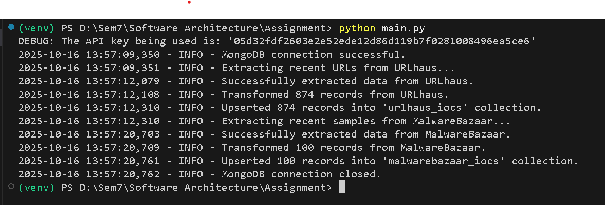
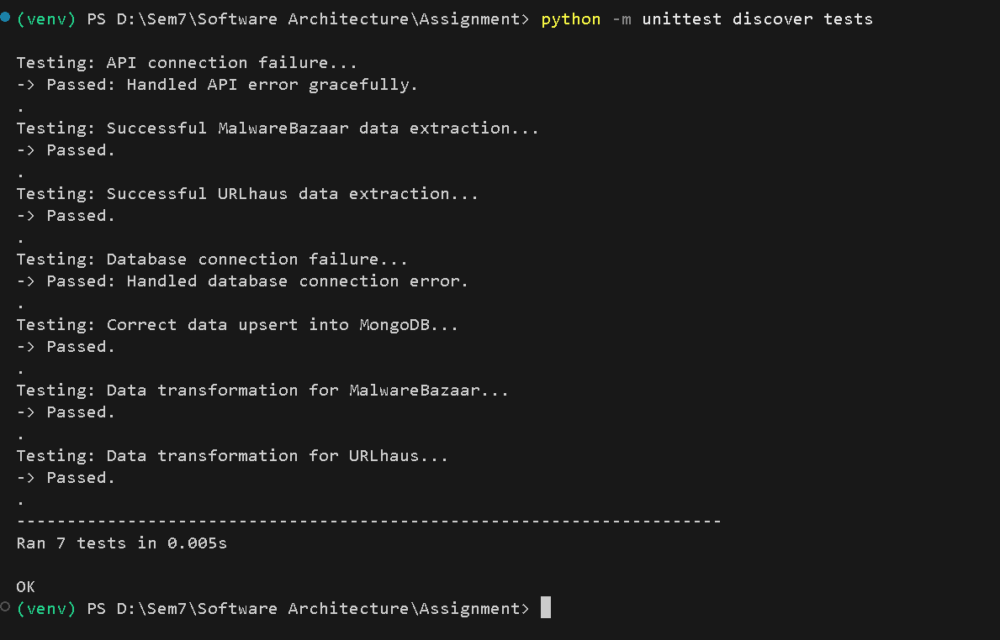
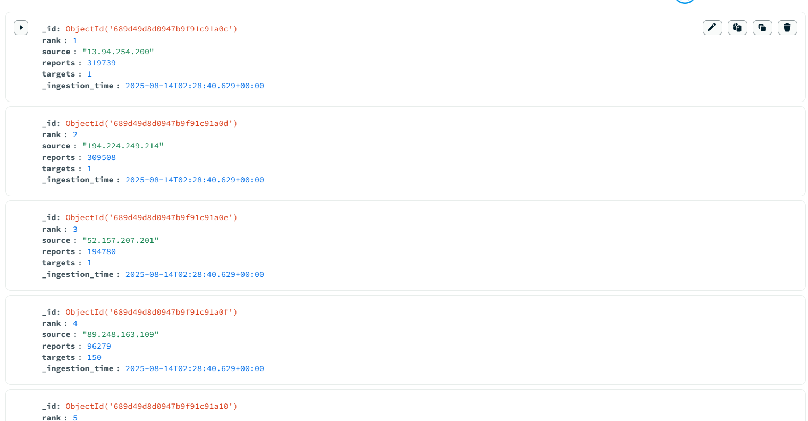

# AbuseCH ETL Connector

**Connector file:** `connectors/abusech_api.py`

## Overview
This repository contains an ETL connector that extracts threat intelligence from the AbuseCH project APIs — **URLhaus** and **MalwareBazaar** — transforms the returned JSON into a MongoDB-friendly format and loads it into dedicated MongoDB collections for downstream analysis.

The connector is implemented in `connectors/abusech_api.py` and provides two high-level extraction methods:
- `get_urlhaus_recent()` — fetch recent URL submissions from URLhaus
- `get_malwarebazaar_recent()` — fetch recent sample metadata from MalwareBazaar

The connector uses an API key (passed via headers) and Python's `logging` to record progress and errors.

---

## Features
- Securely loads API key from environment (.env recommended).
- Graceful handling of API/network errors with informative logs.
- Two extraction methods for URLhaus and MalwareBazaar.
- Lightweight and easy to integrate into a full ETL pipeline (transform + load).

---

## Quick start

### 1. Clone the repository and switch to your branch
```bash
git clone <repo-url>
cd <your-branch-name>
```

### 2. Create a virtual environment and install dependencies
```bash
python -m venv venv
# Activate the venv
# Windows
venv\Scripts\activate
# macOS / Linux
source venv/bin/activate

pip install -r requirements.txt
```

### 3. Create your `.env` file (local only — do not commit)
Create a `.env` file at the project root with the following keys:
```ini
ABUSECH_API_KEY=your_api_key_here
MONGO_URI=mongodb://localhost:27017
MONGO_DB=threat_intel
```
Add `.env` to `.gitignore` before committing.

### 4. Run unit tests
```bash
python -m unittest discover tests
```

---

## Connector usage example
Below is a minimal usage example showing how to extract data with the connector. The connector only performs the **Extract** step; you should implement the Transform and Load parts (or integrate with an existing loader).

```python
# example_run.py
import os
from dotenv import load_dotenv
from connectors.abusech_api import AbuseCHConnector

load_dotenv()
api_key = os.getenv('ABUSECH_API_KEY')

connector = AbuseCHConnector(api_key=api_key)

# Extract recent URLhaus entries
urlhaus_json = connector.get_urlhaus_recent()
if urlhaus_json is not None:
    # Transform & load logic goes here
    print(f"Got {len(urlhaus_json.get('data', []))} items from URLhaus")

# Extract recent MalwareBazaar entries
mb_json = connector.get_malwarebazaar_recent()
if mb_json is not None:
    # Transform & load logic goes here
    print(f"Got result: {mb_json.get('query_status')}")
```

---

## Recommended MongoDB strategy
- Use **one collection per connector** to keep raw inputs separated and auditable:
  - `urlhaus_raw`
  - `malwarebazaar_raw`
- Store ingestion metadata on each document:
  - `ingested_at` (UTC timestamp)
  - `source` (e.g., "URLhaus")
  - `raw_payload` (store the original JSON for auditability)
- Keep normalized fields for common queries: `ioc_value`, `ioc_type`, `first_seen`, `threat_level`, `tags`.

Example transformed document shape (suggested):
```json
{
  "source": "URLhaus",
  "ioc_type": "url",
  "ioc_value": "http://1.2.3.4/malware",
  "first_seen": "2025-10-15T20:09:18Z",
  "tags": ["malspam", "downloader"],
  "threat_level": "medium",
  "threat_type": "malware_download",
  "raw_payload": { ... },
  "ingested_at": "2025-10-15T21:00:00Z"
}
```

---

## Logging
The connector uses Python's `logging` module. Example configuration is included inside the connector file:
```python
logging.basicConfig(level=logging.INFO, format='%(asctime)s - %(levelname)s - %(message)s')
```
- `INFO` messages report successful extraction.
- `ERROR` messages report network/API errors.

---

## Testing & Validation
Include unit tests that cover:
- API connection failures (simulate network/API errors and assert connector returns `None` or handles error).
- Successful extraction responses (mock the HTTP responses and assert parsed JSON is returned).
- Database connectivity errors (if you include load tests, mock PyMongo to assert upsert behavior).

Run tests with:
```bash
python -m unittest discover tests
```

Sample expected test output (your tests may differ):
```
Ran 7 tests in 0.005s

OK
```

---

## Requirements (suggested `requirements.txt`)
```
requests
python-dotenv
pymongo
pytest
```

---

## Project structure (suggested)
```
/your-branch-name/
├── connectors/
│   └── abusech_api.py
├── database/
│   └── mongo_loader.py            
├── tests/
│   └── test_abusech_etl.py
├── transformation/
│   └── data_transformer.py
├── main.py
```

---

## Author
Add your name and roll number before submission.

**Author:** Nikilesh
**Roll Number:** 3122225001081
**Course:** Software Architecture — SSN CSE

---

## How to Run

### Running the ETL Pipeline

To run the main script and start the ETL process, execute the `main.py` file.

```bash
python main.py
```


### Running the Tests

To run the complete test suite, use the `unittest discover` command from the project root.

```bash
python -m unittest discover
```



-----

-----

## Testing Strategy

The pipeline is validated by a comprehensive test file that covers all modules of the project. The strategy focuses on unit tests that run in isolation without requiring live service connections.

1.  **Transformation Logic Tests**: These tests validate the core business logic of the transformms module. They use sample raw data to assert that the output structure and calculated fields are correct.
2.  **Pipeline Robustness Tests**: These tests use **`unittest.mock`** to simulate API and database behavior. They verify that the pipeline can gracefully handle external issues like API errors (e.g., 403 Forbidden) and database connection failures without crashing.

-----

## Output

After a successful run, the data will be available in your MongoDB instance. You can use a tool like MongoDB Compass to view the collections inside the  database.




