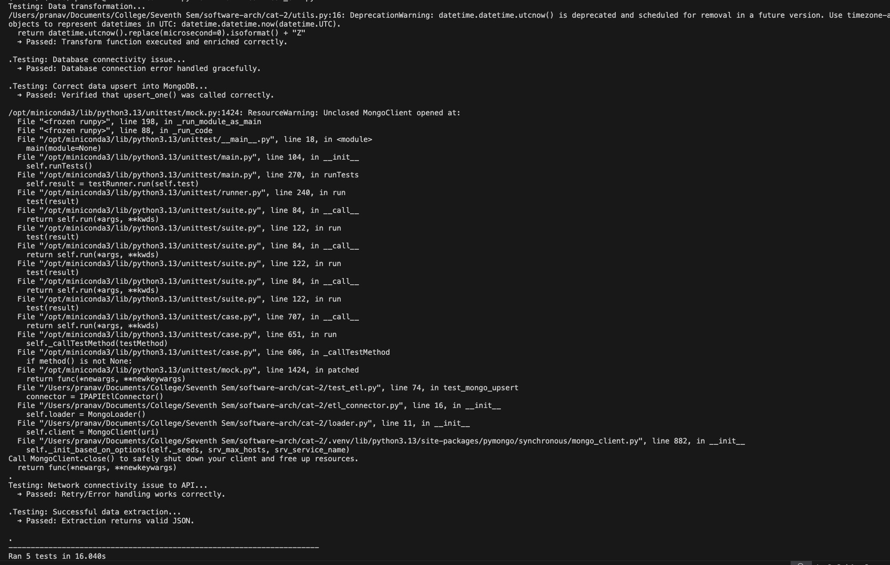

# 🛰️ IP-API ETL Connector

A **modular Python ETL pipeline** that extracts geolocation and network intelligence data from [ip-api.com](http://ip-api.com), transforms it with domain enrichment and structured normalization, and loads the processed data into a local **MongoDB** database (viewable in MongoDB Compass).

This project demonstrates a full **Extract → Transform → Load (ETL)** process — designed for data engineering and software integration assignments that emphasize API-driven data pipelines.

---

## 🧭 Project Overview

`ipapi-etl` automates data collection from the [ip-api.com](http://ip-api.com) service to create a rich and queryable dataset of IP and domain intelligence.  

It:
- **Extracts** raw geolocation data for IPs/domains.
- **Transforms** it into a clean, enriched, and standardized schema.
- **Loads** it into a local MongoDB collection with proper indexes.

This project was built to demonstrate:
- Modular ETL architecture design.
- Clean environment-based configuration management (`.env`).
- Complex transformation logic with enrichment and validation.
- MongoDB schema design and indexing for analytics.

---

## ⚙️ Key Features

| Feature | Description |
|----------|--------------|
| 🔌 **API Integration** | Connects to ip-api’s `/json`, `/batch`, and `/csv` endpoints. |
| ♻️ **ETL Pipeline** | Extract → Transform → Load workflow with retry and rate-limit handling. |
| 🧠 **Complex Transformations** | ASN parsing, GeoJSON conversion, private IP detection, DNS enrichment. |
| 🧱 **MongoDB Storage** | Local database with auto-created indexes for fast querying. |
| 🧰 **.env Configuration** | Environment-based configuration for portability and security. |
| 🧩 **Modular Design** | Separate modules for config, fetch, transform, load, and orchestration. |
| 🚀 **Reusable Connector** | Importable `IPAPIEtlConnector` class for integration into other systems. |

---

## 🌐 API Details

**http://ip-api.com**  


**Main Endpoints:**
| Endpoint | Description | Example |
|-----------|--------------|----------|
| `/json/{query}` | Fetch IP or domain details as JSON | `/json/8.8.8.8` |
| `/batch` | POST an array of queries for bulk lookup | `/batch` |
| `/csv/{query}` | Retrieve data as CSV (optional fields) | `/csv/1.1.1.1?fields=status,country` |
| `/edns` | Extended DNS client subnet info | `/edns` |

**Rate Limits:**  
- `/json` — 45 requests/min  
- `/batch` — 15 requests/min  
(Handled automatically by the ETL)

---

## 🧬 ETL Pipeline

### 1. **Extract**
- Fetches IP or domain data using `requests`.
- Supports single or batch extraction.
- Implements exponential backoff and retry via `tenacity`.

### 2. **Transform**
- Cleans and enriches data:
  - Converts lat/lon → GeoJSON.
  - Parses ASN strings like `"AS15169 Google LLC"`.
  - Detects if the IP is private, loopback, or reserved.
  - For domain queries, performs DNS resolution (`A`/`AAAA` lookups).
  - Adds metadata fields (`fetched_at`, `loaded_at`).

### 3. **Load**
- Loads transformed data into MongoDB.
- Uses `upsert_one` and `bulk_insert` with error handling.
- Auto-creates indexes for:
  - `ip`
  - `query_original`
  - `meta.fetched_at`
  - `location` (`2dsphere` index)

---

## 🧩 Example Transformation

**Raw API Response:**
```json
{
  "status": "success",
  "country": "United States",
  "countryCode": "US",
  "region": "CA",
  "regionName": "California",
  "city": "Mountain View",
  "zip": "94043",
  "lat": 37.4192,
  "lon": -122.0574,
  "timezone": "America/Los_Angeles",
  "isp": "Google LLC",
  "org": "Google LLC",
  "as": "AS15169 Google LLC",
  "query": "8.8.8.8"
}
```

## Project Structure

ipapi-etl/
├─ .env                     # Environment variables (private)
├─ env_template             # Example template for env setup
├─ .gitignore               # Ignore cache, env, and build files
├─ config.py                # Loads environment + config values
├─ utils.py                 # Utility functions (DNS, IP, time)
├─ fetcher.py               # Handles API requests & retries
├─ transformer.py           # Data cleaning & enrichment
├─ loader.py                # MongoDB loader with indexing
├─ etl_connector.py         # High-level ETL connector class
├─ etl_runner.py            # CLI runner script
├─ requirements.txt         # Dependencies list
└─ README.md                # Documentation


## 🧪 Testing the ETL Connector

All components of the ETL pipeline are covered by a structured **unit test suite** built using Python’s `unittest` framework.

The test cases verify:
1. **Network connectivity handling** — ensures retries and exceptions are correctly managed when API calls fail.  
2. **Data extraction** — confirms valid JSON is returned from mocked ip-api responses.  
3. **Data transformation** — checks normalization logic (GeoJSON, ASN parsing, private IP detection).  
4. **MongoDB upsert** — ensures `upsert_one()` is called correctly and handles inserts gracefully.  
5. **Database connectivity errors** — validates that connection issues raise exceptions properly.

### ✅ Running the Tests

From the project root:
```bash
python -m unittest test_etl.py
```

