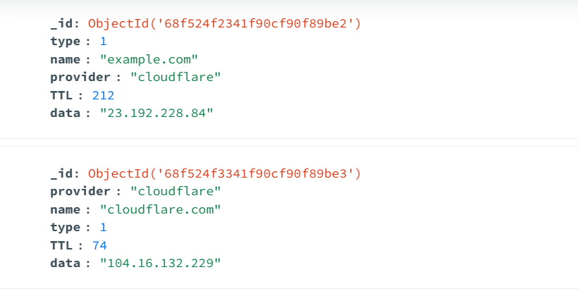
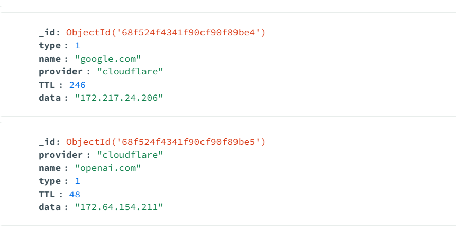
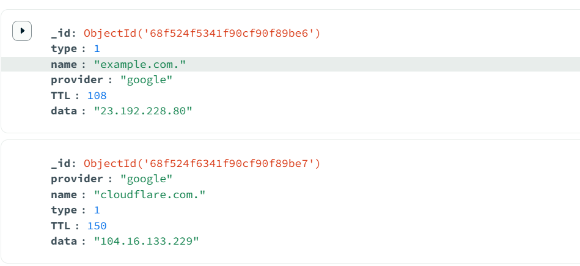
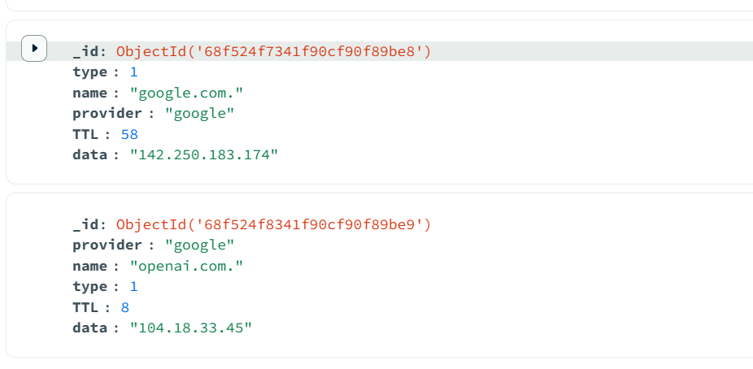
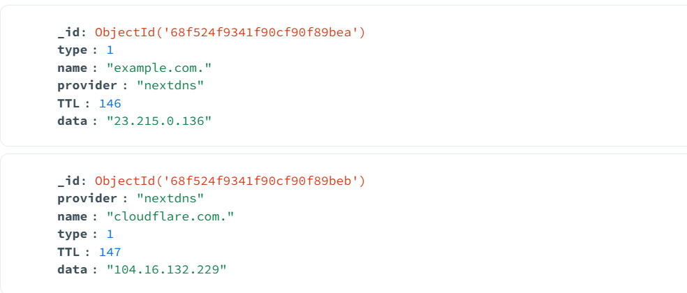
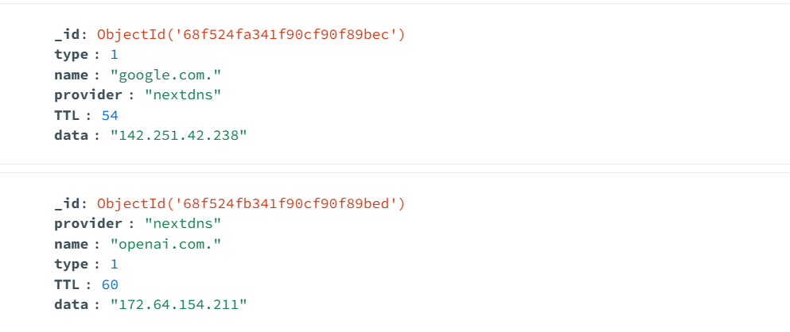

# Custom Python ETL Connector for DNS-over-HTTPS

## Overview
This ETL script extracts DNS A record data for a set of domains using **Cloudflare, Google, and NextDNS** DNS-over-HTTPS (DoH) endpoints, transforms the data into a structured format, and loads it into **MongoDB** collections.

## Environment Variables
Create a `.env` file with the following template:

- MONGO_URI=mongodb://localhost:27017
- MONGO_DB=your_db_name
- NEXTDNS_PROFILE_ID=your_nextdns_profile_id

**Important:** Do not commit `.env` to Git.

## Setup
1. Clone the repository and create your branch.
2. Create and fill the `.env` file.
3. Install dependencies:

```bash
pip install -r requirements.txt

```

## Usage

Run the ETL connector:

```bash
python etl_connector.py
```

## Script Overview

The script will:

- Query the DNS A records for the domains listed in `domains`.
- Transform responses into structured dictionaries:
  - `name`
  - `type`
  - `TTL`
  - `data`
  - `provider` (cloudflare/google/nextdns)
- Load the data into separate MongoDB collections.

Duplicates are avoided by updating existing records based on `name`, `type`, and `provider`.

## Git Guidelines

- Do not commit `.env`.
- Write clear commit messages (include your name and roll number if required).
- Push to your branch and submit a Pull Request when done.

## Output Screenshots

### Cloudflare
  


### Google
  


### NextDNS
  
