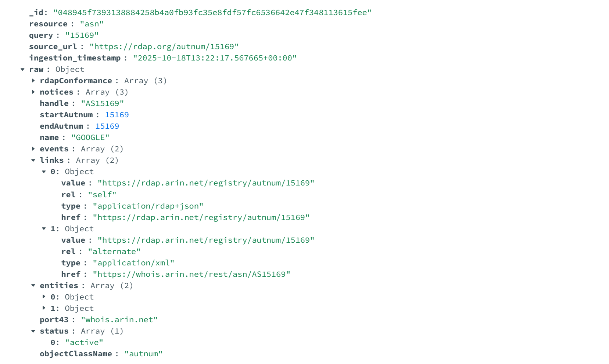
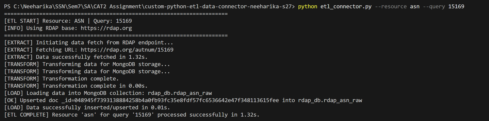
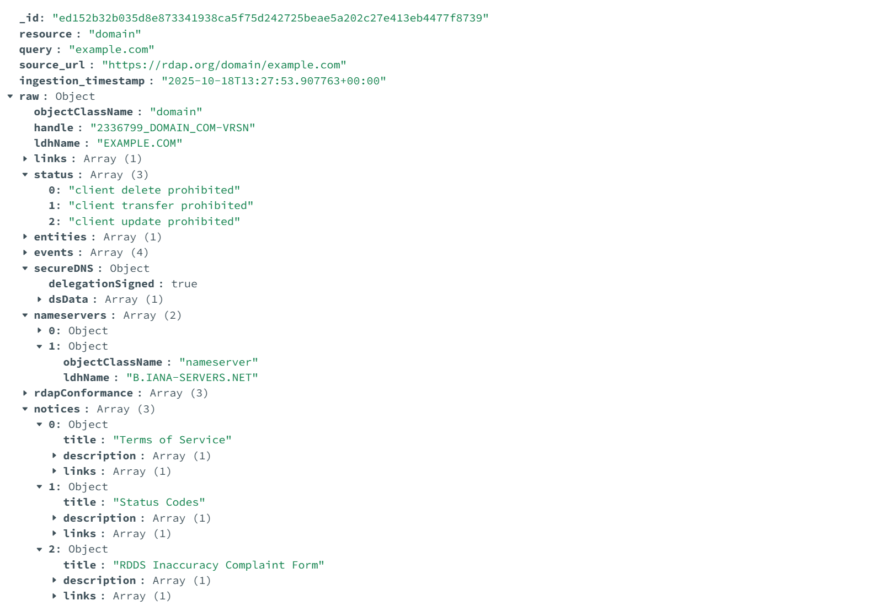
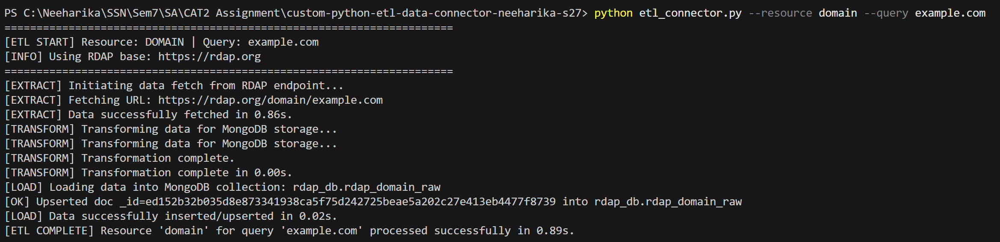
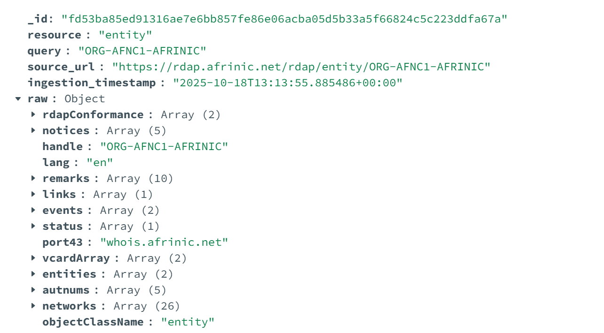
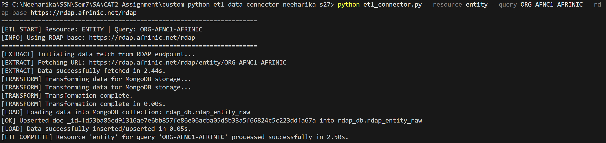
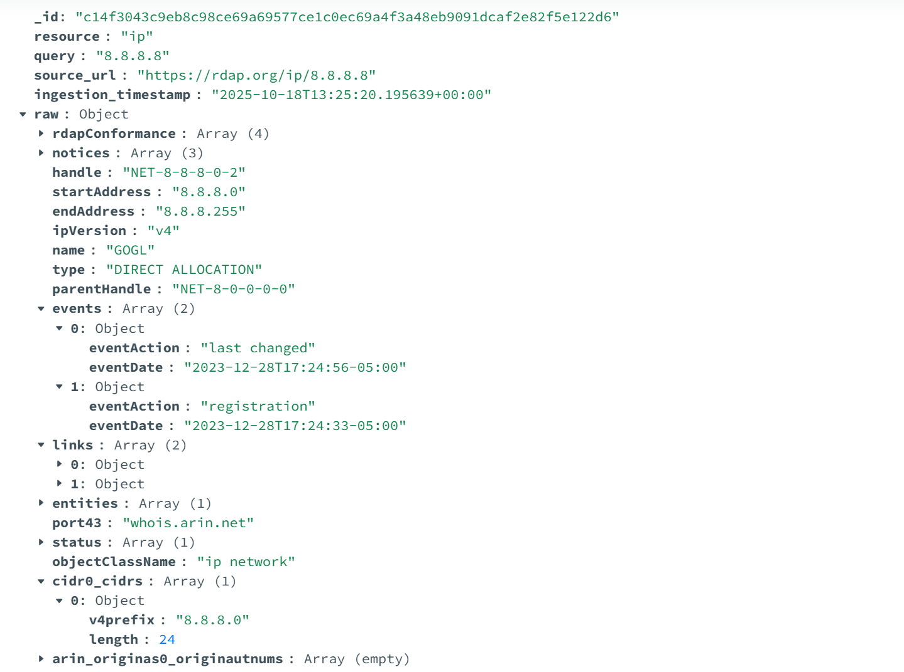
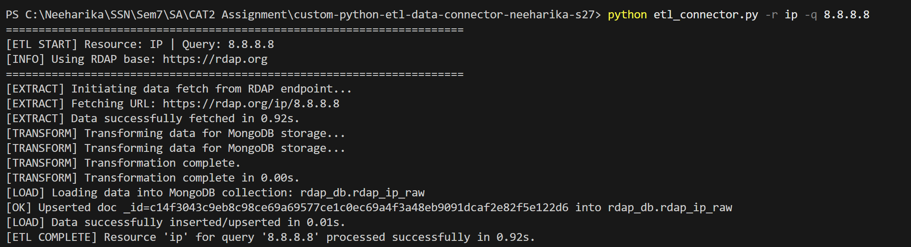
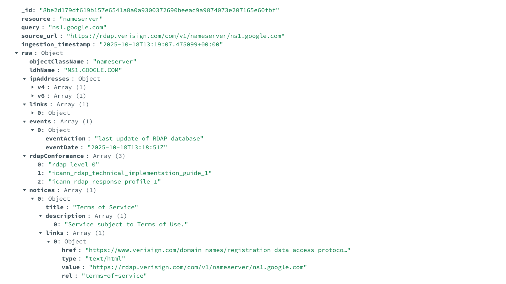
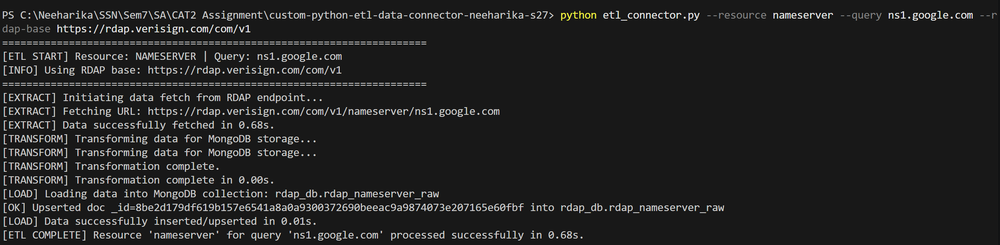

# RDAP ETL Connector

#### Author : S Neeharika (3122 22 5001 079)

<hr>

## 📝 Project Overview

This project implements a custom Python ETL (Extract, Transform, Load) connector that interacts with the [RDAP API](https://www.arin.net/resources/registry/whois/rdap/)
 — a standardized service that provides registration data for internet resources such as domains, IP addresses, Autonomous System Numbers (ASNs), nameservers, and entities.

The ETL connector performs the following:

**Extracts** structured WHOIS and registration information from RDAP endpoints.
**Transforms** the JSON response for MongoDB compatibility and attaches ingestion metadata.
**Loads** the transformed data into a MongoDB collection for auditing and analysis.

Each execution securely connects to the API, handles rate limits and retries, and logs ETL status clearly in the terminal.

---

## 🌐 API Endpoints Used

### **1. ASN (Autonomous System Number) Lookup**

Fetches information about an AS number (used by ISPs or organizations).

**Endpoint:**

```bash
GET GET https://rdap.org/autnum/{asn}
```

**Example Query:**

```bash
15169
```

### **2. Domain Lookup**

Retrieves WHOIS registration details for a domain name.

**Endpoint:**

```bash
GET https://rdap.org/domain/{domain}
```

**Example Query:**

```bash
example.com
```

### **3. Entity Lookup**

Provides registration data for a contact handle or entity within RDAP.

**Endpoint:**

```bash
GET https://rdap.org/entity/{entity_handle}
```

**Example Query:**

```bash
ARIN-ARIN (valid example from ARIN registry)
```

### **4. IP Address Lookup**

Retrieves network and allocation information for an IP address.

**Endpoint:**

```bash
GET https://rdap.org/ip/{ip_address}
```

**Example Query:**

```bash
8.8.8.8
```

### **5. Nameserver Lookup**

Retrieves RDAP data for a nameserver.

**Endpoint:**

```bash
GET GET https://rdap.org/nameserver/{nameserver}
```

**Example Query:**

```bash
ns1.google.com 
```

---

## ⚙️ Setup and Installation

<h5>1. Clone the repository</h5>

```bash
git clone https://github.com/Kyureeus-Edtech/custom-python-etl-data-connector-neeharika-s27/
```

<h5>2. Install dependencies</h5>

```bash
pip install -r requirements.txt 
```

<h5>3. Create .env file</h5>

```bash
MONGO_URI=mongodb://localhost:27017
MONGO_DB=rdap_db
RDAP_BASE=https://rdap.org
USER_AGENT=ssn-rdap-etl/1.0
REQUEST_TIMEOUT=30
HTTP_MAX_RETRIES=3
HTTP_BACKOFF_FACTOR=1

```
<hr>

## 🚀 Usage

<h5>Run the ETL pipeline</h5>

### Asn Example

```bash
python etl_connector.py --resource asn --query 15169
```

<h4>Sample Data Inserted in MongoDB</h4>



<h4>Progress Tracked in Terminal</h4>




### Domain Example

```bash
python etl_connector.py --resource domain --query example.com
```

<h4>Sample Data Inserted in MongoDB</h4>



<h4>Progress Tracked in Terminal</h4>



### Entity Example

```bash
python etl_connector.py --resource entity --query ORG-AFNC1-AFRINIC --rdap-base https://rdap.afrinic.net/rdap
```

<h4>Sample Data Inserted in MongoDB</h4>



<h4>Progress Tracked in Terminal</h4>



### Ip Example

```bash
python etl_connector.py -r ip -q 8.8.8.8
```

<h4>Sample Data Inserted in MongoDB</h4>



<h4>Progress Tracked in Terminal</h4>



### Nameserver Example

```bash
python etl_connector.py --resource nameserver --query ns1.google.com --rdap-base https://rdap.verisign.com/com/v1
```

<h4>Sample Data Inserted in MongoDB</h4>



<h4>Progress Tracked in Terminal</h4>




<hr>

### 🛡️ Error Handling Mechanisms

<hr>

##### 1. Invalid Resource / 404 Handling

```bash
if resp.status_code == 404:
    print(f"[INFO] 404 Not found for URL {url}")
    return {"rdap_not_found": True, "status_code": 404, "url": url}
```

##### 2. Rate Limiting (429) with Backoff

```bash
if resp.status_code == 429:
    retry_after = resp.headers.get("Retry-After")
    wait = int(retry_after) if retry_after else BACKOFF_FACTOR * (2 ** (attempt - 1))
    time.sleep(wait)
```

##### 3. Server Errors (5xx)

```bash
if 500 <= resp.status_code < 600:
    print(f"[WARN] Server error {resp.status_code}, retrying...")
    time.sleep(BACKOFF_FACTOR * (2 ** (attempt - 1)))
```

##### 4. Network Errors

```bash
except requests.RequestException as e:
    print(f"[ERROR] Network error: {e}")
    time.sleep(BACKOFF_FACTOR * (2 ** (attempt - 1)))
```

##### 5. MongoDB Upsert Failures

```bash
except errors.PyMongoError as e:
    print(f"[ERROR] MongoDB error: {e}")
```

<hr>

## 🗂️ Project Structure

```bash
custom-python-etl-data-connector-neeharika-s27/
├── README.md                  # Project documentation
├── requirements.txt           # Python dependencies
├── .gitignore                 # Ignore .env
├── etl_connector.py           # Entry point to run the ETL process
├── Outputs                    # Output image screenshots      
    ├── asn_endpoint_mongodb.png            # asn endpoint MongoDB output image screenshot
    ├── asn_endpoint_terminal.png           # asn endpoint terminal output image screenshot
    ├── domain_endpoint_mongodb.png         # domain endpoint MongoDB output image screenshot
    ├── domain_endpoint_terminal.png        # domain endpoint terminal output image screenshot
    ├── entity_endpoint_mongodb.png         # entity endpoint MongoDB output image screenshot
    ├── entity_endpoint_terminal.png        # entity endpoint terminal output image screenshot
    ├── ip_endpoint_mongodb.png             # ip endpoint MongoDB output image screenshot
    ├── ip_endpoint_terminal.png            # ip endpoint terminal output image screenshot
    ├── nameserver_endpoint_mongodb.png     # nameserver endpoint MongoDB output image screenshot
    ├── nameserver_endpoint_terminal.png    # nameserver endpoint terminal output image screenshot
```

<hr>

## 📌 Summary 

The RDAP ETL Connector automates the collection of registration data across multiple internet resource types (Domain, IP, ASN, Nameserver, Entity).
It demonstrates the design of a modular and resilient ETL pipeline in Python that securely extracts data from public APIs, transforms it for audit-ready MongoDB storage, and logs progress in a clear, time-tracked manner.

This connector adheres to secure coding, error-tolerant ETL design, and open-source architecture principles, forming a reusable data ingestion framework for network intelligence and cyber research.

<hr>
