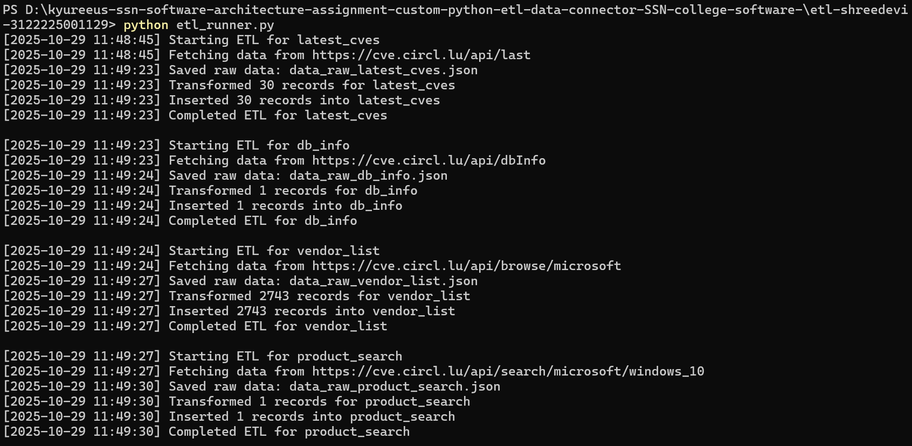
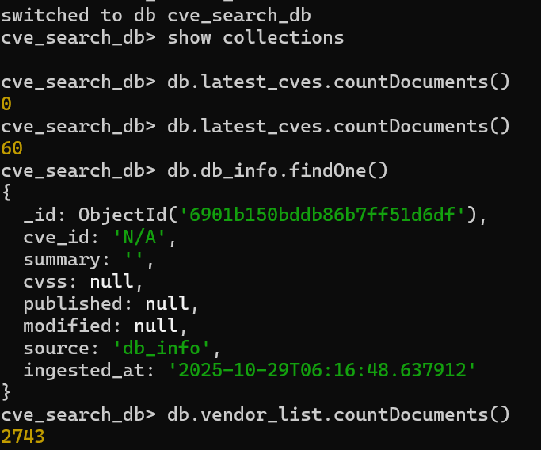

# 🧠 CVE Search ETL Connector  
**Student:** Shreedevi R (Reg No: 3122225001129)  
**Assignment:** Software Architecture – ETL Connector (Kyureeus EdTech, SSN CSE)

## 🚀 Overview
This ETL pipeline connects to the CIRCL CVE Search API to extract vulnerability data, transform it into MongoDB-compatible JSON, and store it locally for security analytics.

## 🧱 Modules
| Layer | File | Role |
|--------|------|------|
| Extract | `core/extractor.py` | Calls REST API endpoints |
| Transform | `core/transformer.py` | Cleans JSON into uniform schema |
| Load | `core/loader.py` | Pushes data into MongoDB |
| Utils | `core/utils.py` | Handles logging & timestamps |

## 🌐 Data Sources
| Feed | Endpoint | Purpose |
|------|-----------|----------|
| Latest CVEs | `/api/last` | Fetches recent CVE entries |
| Database Info | `/api/dbInfo` | Fetches CVE database metadata |
| Vendor List | `/api/browse/microsoft` | Lists products under Microsoft |
| Product Search | `/api/search/microsoft/windows_10` | Searches CVEs by product |

## 💾 How to Run
1. Start MongoDB locally:  
   `mongod`
2. In a terminal:  
   ```bash
   cd etl-shreedevi-3122225001129
   pip install -r requirements.txt
   python etl_runner.py

3. Validate in Mongo shell:
    use cve_search_db
    show collections
    db.latest_cves.countDocuments()

✅ Output

Collections created:
latest_cves
db_info
vendor_list
product_search

## 📸 Output Screenshots

**✅ ETL Execution**


**📦 MongoDB Collections**

