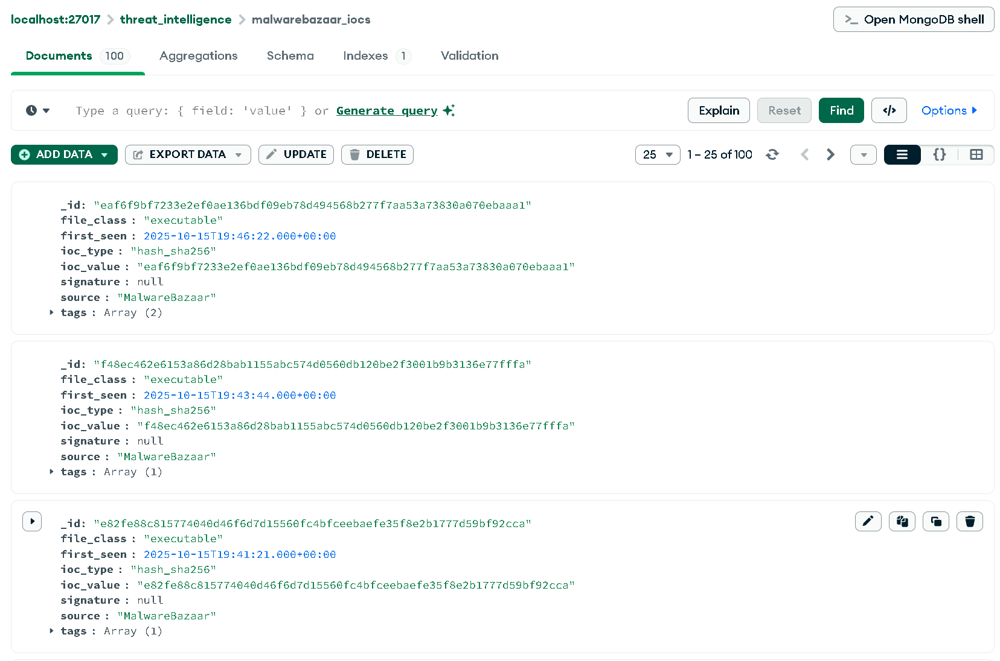
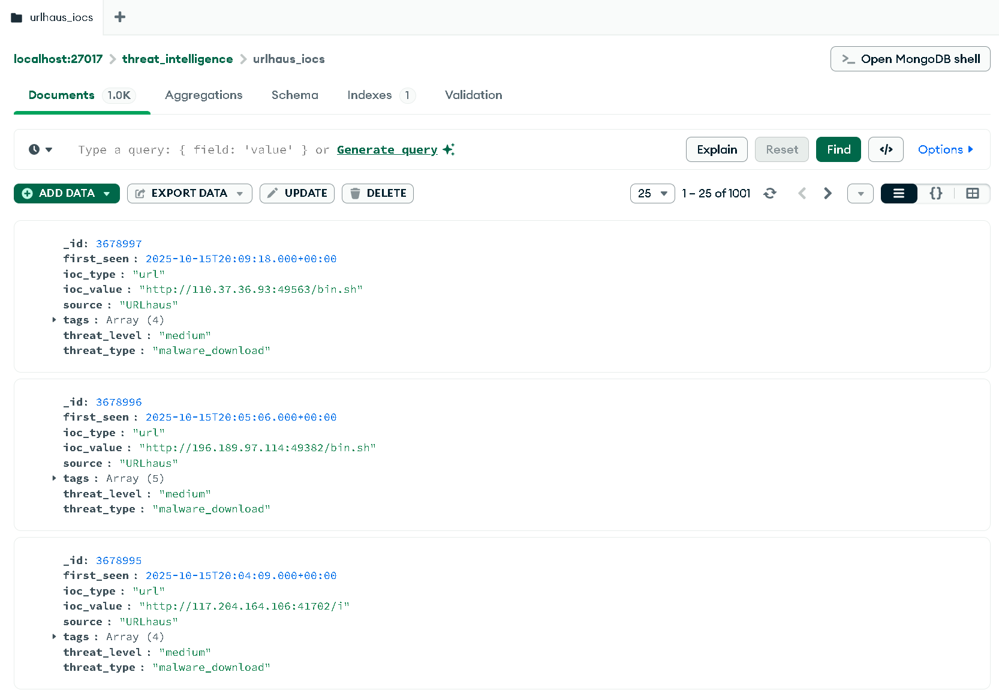

# Abuse.ch Threat Intelligence ETL Pipeline

This project is an ETL (Extract, Transform, Load) pipeline built with Python for a software architecture assignment. It extracts real-time cybersecurity threat intelligence data from the [abuse.ch](https://abuse.ch/) project APIs, transforms the data into a clean and standardized format, and loads it into a local MongoDB database for analysis.

## Features
- **Extract**: Connects to the URLhaus and MalwareBazaar APIs to fetch recent threat indicators.
- **Transform**:
    - Standardizes data from different sources into a unified schema.
    - Handles data inconsistencies from the APIs, such as `null` values and multiple date formats.
    - Enriches data with custom fields (e.g., `threat_level`, `file_class`).
- **Load**: Inserts the transformed data into a MongoDB database, using an `upsert` operation to prevent duplicate entries on subsequent runs.
- **Modular Architecture**: The code is organized into distinct modules for extraction, transformation, and loading, making it easy to maintain and extend.
- **Secure Configuration**: Uses a `.env` file to securely manage API keys and database connection strings.

---

## Tech Stack
- **Language**: Python 3
- **Database**: MongoDB
- **Key Libraries**:
    - `requests`: For making HTTP requests to the APIs.
    - `pymongo`: For interacting with the MongoDB database.
    - `python-dotenv`: For managing environment variables.

---

## Project Structure
    The project uses a modular structure to separate concerns:

    abusech_etl/
    ├── .env
    ├── .env.template
    ├── main.py
    ├── config.py
    ├── requirements.txt
    ├── connectors/
    │   └── abusech_api.py
    ├── transformations/
    │   └── data_transformer.py
    └── database/
        └── mongo_loader.py

---

## Setup and Installation

### Prerequisites
- Python 3.8 or newer
- MongoDB Server installed and running locally.
- [MongoDB Compass](https://www.mongodb.com/products/compass) (optional, but recommended for viewing data).

### Steps
1.  **Clone the repository** (or download the source code).
    ```sh
    git clone <your-repo-url>
    cd abusech_etl
    ```
2.  **Create and activate a Python virtual environment**:
    ```sh
    # Windows
    python -m venv venv
    venv\Scripts\activate
    ```
3.  **Install the required dependencies**:
    ```sh
    pip install -r requirements.txt
    ```

---

## Configuration
1.  **Create a `.env` file** in the project's root directory by copying the template:
    ```sh
    cp .env.template .env
    ```
2.  **Obtain your abuse.ch Auth-Key**:
    - Register an account at the [abuse.ch Authentication Portal](https://auth.abuse.ch/).
    - Generate your `Auth-Key` from your user profile page.
3.  **Update the `.env` file** with your details:
    ```ini
    # For a standard local MongoDB instance
    MONGO_URI="mongodb://localhost:27017/"

    # Your abuse.ch API key
    ABUSECH_API_KEY="paste_your_48_character_key_here"
    ```

---

## Screenshots

### 1. Successful ETL Script Execution
This screenshot shows the console output after the `main.py` script has successfully run, showing the complete ETL process.


### 2. Successful Unit Test Run
This screenshot shows the output of running the test suite, confirming that all unit tests pass.


### 3. MongoDB Data Verification
These screenshots from MongoDB Compass show that the `threat_intelligence` database was created and populated with the transformed data from the APIs.





## Usage
To run the entire ETL pipeline, execute the `main.py` script from the root directory:
```sh
python main.py

